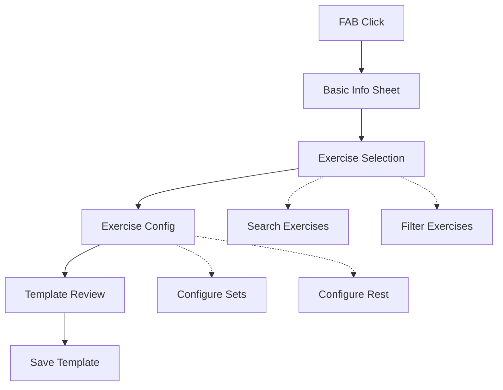

> **ARCHIVED DOCUMENT**: This document is outdated and kept for historical reference only. Please refer to [Template Organization and Creation](../features/library/template_organization.md) for up-to-date information.

# Workout Template Creation Design Document

## Problem Statement
Users need a guided, step-by-step interface to create strength workout templates. The system should focus on the core strength training features while maintaining an architecture that can be extended to support other workout types in the future.

## Requirements

### Functional Requirements (MVP)
- Create strength workout templates
- Configure basic template metadata
- Select exercises from library
- Configure sets/reps/rest for each exercise
- Preview and edit template before saving
- Save templates to local storage

### Non-Functional Requirements
- Sub-500ms response time for UI interactions
- Consistent shadcn/ui theming
- Mobile-first responsive design
- Offline-first data storage
- Error state handling
- Loading state management

## Design Decisions

### 1. Multi-Step Flow vs Single Form
Chosen: Multi-step wizard pattern

Rationale:
- Reduces cognitive load
- Clear progress indication
- Easier error handling
- Better mobile experience
- Simpler to extend for future workout types

### 2. Exercise Selection Interface
Chosen: Searchable list with quick-add functionality

Rationale:
- Faster template creation
- Reduces context switching
- Maintains flow state
- Supports future search/filter features

## Technical Design

### Flow Diagram


### Database Schema
```sql
-- Workout Templates (Nostr 33402 compatible)
CREATE TABLE templates (
  id TEXT PRIMARY KEY,
  title TEXT NOT NULL,
  description TEXT,
  type TEXT NOT NULL DEFAULT 'strength' CHECK(type IN ('strength', 'circuit', 'emom', 'amrap')),
  target_muscle_groups TEXT, -- JSON array
  format_json TEXT,          -- Template-wide parameters
  format_units_json TEXT,    -- Template-wide unit preferences
  duration INTEGER,          -- For future timed workouts (seconds)
  rounds INTEGER,           -- For future circuit/EMOM workouts
  rest_between_rounds INTEGER, -- For future circuit workouts (seconds)
  created_at INTEGER NOT NULL,
  updated_at INTEGER NOT NULL,
  source TEXT NOT NULL DEFAULT 'local',
  nostr_event_id TEXT,      -- For future Nostr sync
  tags TEXT,                -- JSON array for categorization
  FOREIGN KEY(nostr_event_id) REFERENCES nostr_events(id)
);

-- Template Exercises (Nostr exercise references)
CREATE TABLE template_exercises (
  template_id TEXT NOT NULL,
  exercise_id TEXT NOT NULL,
  order_index INTEGER NOT NULL,
  sets INTEGER NOT NULL,
  reps INTEGER NOT NULL,
  weight REAL,              -- In kg, null for bodyweight
  rpe INTEGER CHECK(rpe BETWEEN 1 AND 10),
  set_type TEXT CHECK(set_type IN ('warmup', 'normal', 'drop', 'failure')),
  rest_seconds INTEGER,
  notes TEXT,
  format_json TEXT,         -- Exercise-specific parameters
  format_units_json TEXT,   -- Exercise-specific unit preferences
  FOREIGN KEY(template_id) REFERENCES templates(id) ON DELETE CASCADE,
  FOREIGN KEY(exercise_id) REFERENCES exercises(id)
);
```

### Core Types
```typescript
interface StrengthTemplate {
  id: string;
  title: string;
  description?: string;
  type: 'strength';
  targetMuscleGroups: string[];
  exercises: TemplateExercise[];
  created_at: number;
  updated_at: number;
  source: 'local' | 'powr' | 'nostr';
  format?: {
    // Template-wide format settings
    weight?: boolean;
    reps?: boolean;
    rpe?: boolean;
    set_type?: boolean;
  };
  format_units?: {
    weight: 'kg' | 'lbs';
    reps: 'count';
    rpe: '0-10';
    set_type: 'warmup|normal|drop|failure';
  };
}

interface TemplateExercise {
  exerciseId: string;
  orderIndex: number;
  sets: number;
  reps: number;
  weight?: number;
  rpe?: number;
  setType: 'warmup' | 'normal' | 'drop' | 'failure';
  restSeconds?: number;
  notes?: string;
  format?: {
    // Exercise-specific format overrides
    weight?: boolean;
    reps?: boolean;
    rpe?: boolean;
    set_type?: boolean;
  };
  format_units?: {
    weight?: 'kg' | 'lbs';
    reps?: 'count';
    rpe?: '0-10';
    set_type?: 'warmup|normal|drop|failure';
  };
}
```

### Component Specifications

#### 1. Template Creation Sheet
```typescript
interface TemplateCreationSheetProps {
  isOpen: boolean;
  onClose: () => void;
  onComplete: (template: StrengthTemplate) => void;
}
```

#### 2. Basic Info Form
```typescript
interface BasicInfoForm {
  title: string;
  description?: string;
  targetMuscleGroups: string[];
}

const TARGET_MUSCLE_GROUPS = [
  'Full Body',
  'Upper Body',
  'Lower Body',
  'Push',
  'Pull',
  'Legs'
];
```

#### 3. Exercise Configuration Form
```typescript
interface ExerciseConfigFormProps {
  exercise: Exercise;
  onConfigComplete: (config: TemplateExercise) => void;
}
```

#### 4. Template Preview
```typescript
interface TemplatePreviewProps {
  template: StrengthTemplate;
  onEdit: (exerciseId: string) => void;
  onReorder: (newOrder: string[]) => void;
}
```

### UI States

#### Loading States
- Skeleton loaders for exercise list
- Disabled buttons during operations
- Progress indicators for saves

#### Error States
- Validation error messages
- Database operation errors
- Required field notifications

#### Success States
- Save confirmations
- Creation completion
- Navigation prompts

## Implementation Plan

### Phase 1: Core Template Creation
1. Database schema updates
   - Add templates table
   - Add template_exercises table
   - Add indexes for querying

2. Basic template creation flow
   - Template info form
   - Exercise selection
   - Basic set/rep configuration
   - Template preview and save

### Phase 2: Enhanced Features
1. Exercise reordering
2. Rest period configuration
3. Template duplication
4. Template sharing

## Testing Strategy

### Unit Tests
- Form validation logic
- State management
- Data transformations
- Component rendering

### Integration Tests
- Full template creation flow
- Data persistence
- Error handling
- State management

### End-to-End Tests
- Complete template creation
- Exercise selection
- Template modification
- Database operations

## Future Considerations

### Planned Enhancements
- Circuit workout support
- EMOM workout support
- AMRAP workout support
- Complex progression schemes
- Template variations

### Potential Features
- Template sharing via Nostr
- Exercise substitutions
- Previous workout data import
- AI-assisted template creation
- Advanced progression schemes

### Technical Debt Prevention
- Maintain Nostr compatibility
- Keep workout type abstraction
- Plan for unit conversions
- Consider sync conflicts
- Design for offline-first

## Success Metrics

### Performance
- Template creation < 30 seconds
- Exercise addition < 2 seconds
- UI response < 100ms
- Save operation < 500ms

### User Experience
- Template reuse rate
- Exercise variation
- Completion rate
- Error rate
