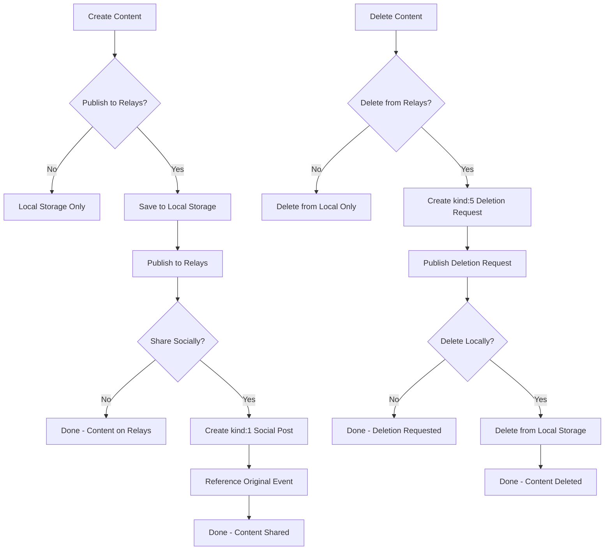
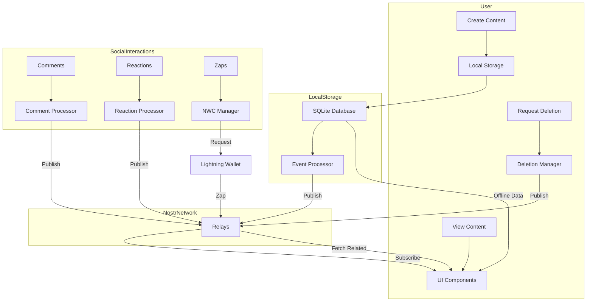

# POWR Social Features Design Document

## Problem Statement
POWR needs to integrate social features that leverage the Nostr protocol while maintaining a local-first architecture. The system must provide a seamless way for users to share workout content, receive feedback, and engage with the fitness community without compromising the standalone functionality of the application. Additionally, the implementation must support future integration with value-exchange mechanisms through Nostr Wallet Connect.

## Requirements

### Functional Requirements
- Custom Nostr event types for exercises, workout templates, and workout records
- Social sharing of workout content via NIP-19 references
- Content management including deletion requests
- Comment system on exercises, templates, and workout records
- Reactions and likes on shared content
- App discovery through NIP-89 handlers
- Support for zaps and Lightning payments via NWC
- Ability to track template usage and popularity
- User profile and content discovery
- Local-first storage with Nostr sync capabilities

### Non-Functional Requirements
- Performance: Social content loads within 500ms when online
- Security: User private keys are never exposed to the application
- Reliability: All created content must be usable offline
- Usability: Social interactions should be intuitive and seamlessly integrated
- Privacy: Users control what content gets shared publicly
- Scalability: System handles thousands of exercise templates and workout records

## Design Decisions

### 1. Custom Event Kinds vs. Standard Kinds
**Approach**: Use custom event kinds (33401, 33402, 1301) for exercises, templates, and workout records rather than generic kind 1 events.

**Rationale**:
- Custom kinds enable clear data separation and easier filtering
- Avoids confusion between social posts and fitness data
- Enables specialized app handlers via NIP-89
- Aligns with best practices for specialized content types
- Enables distinct validation rules for each content type

**Trade-offs**:
- Requires implementing NIP-89 app handlers for client support
- Less immediate visibility in generic Nostr clients
- Needs additional social sharing mechanism for discovery

### 2. Template-Record Relationship
**Approach**: Implement standalone workout records with explicit references to templates.

**Rationale**:
- Cleaner separation between templates and completed workouts
- More flexible for workouts that modify templates
- Better support for offline-first usage
- Simplifies synchronization logic
- Easier to implement privacy controls

**Trade-offs**:
- Requires custom queries to track template usage
- Doesn't leverage built-in reply notification systems
- Additional relationship management logic needed

### 3. Comments Implementation
**Approach**: Use NIP-22 generic comments system with proper reference structure.

**Rationale**:
- Standardized approach compatible with existing Nostr clients
- Supports threaded conversations
- Clear distinction between content and comments
- Integrates with existing notification systems
- Simple to implement using established patterns

**Trade-offs**:
- Requires filtering to display relevant comments
- Additional UI components for comment display
- Need for moderation tools (client-side filtering)

### 4. Nostr Wallet Connect Integration
**Approach**: Implement NIP-47 Nostr Wallet Connect for Lightning payments and zaps.

**Rationale**:
- Secure payment capabilities without managing private keys
- Enables zaps on workout content
- Creates opportunities for creator compensation
- Integrates with existing Nostr Lightning infrastructure
- Future-proofs for monetization features

**Trade-offs**:
- Additional complexity in wallet connection management
- Dependency on external wallet implementations
- Requires careful error handling for payment flows

### 5. Content Publishing and Deletion Workflow
**Approach**: Implement a three-tier approach to content sharing with NIP-09 deletion requests.

**Rationale**:
- Gives users control over content visibility
- Maintains local-first philosophy
- Provides clear separation between private and public data
- Follows Nostr standards for content management
- Enables social sharing while maintaining specialized data format

**Trade-offs**:
- Deletion on Nostr is not guaranteed across all relays
- Additional UI complexity to explain publishing/deletion states
- Need to track content state across local storage and relays

## Technical Design

### Core Components

```typescript
// Exercise Template Event (Kind 33401)
interface ExerciseTemplate extends NostrEvent {
  kind: 33401;
  content: string; // Detailed instructions
  tags: [
    ["d", string], // Unique identifier
    ["title", string], // Exercise name
    ["format", ...string[]], // Data structure parameters
    ["format_units", ...string[]], // Units for parameters
    ["equipment", string], // Equipment type
    ["difficulty"?, string], // Optional skill level
    ["imeta"?, ...string[]], // Optional media metadata
    ["t"?, string][], // Optional hashtags
  ]
}

// Workout Template Event (Kind 33402)
interface WorkoutTemplate extends NostrEvent {
  kind: 33402;
  content: string; // Workout notes and instructions
  tags: [
    ["d", string], // Unique identifier
    ["title", string], // Workout name
    ["type", string], // Workout type (strength, circuit, etc.)
    ["exercise", ...string[]][], // Exercise references with parameters
    ["rounds"?, string], // Optional rounds count
    ["duration"?, string], // Optional total duration
    ["interval"?, string], // Optional interval duration
    ["rest_between_rounds"?, string], // Optional rest time
    ["t"?, string][], // Optional hashtags
  ]
}

// Workout Record Event (Kind 1301)
interface WorkoutRecord extends NostrEvent {
  kind: 1301;
  content: string; // Workout notes
  tags: [
    ["d", string], // Unique identifier
    ["title", string], // Workout name
    ["type", string], // Workout type
    ["template", "33402:<pubkey>:<d-tag>", "<relay-url>"], // Explicit template reference
    ["exercise", ...string[]][], // Exercises with actual values
    ["start", string], // Start timestamp
    ["end", string], // End timestamp
    ["completed", string], // Completion status
    ["rounds_completed"?, string], // Optional rounds completed
    ["interval"?, string], // Optional interval duration
    ["pr"?, string][], // Optional personal records
    ["t"?, string][], // Optional hashtags
  ]
}

// Social Share (Kind 1)
interface SocialShare extends NostrEvent {
  kind: 1;
  content: string; // Social post text
  tags: [
    // Quote reference to the exercise, template or workout
    ["q", string, string, string], // event-id, relay-url, pubkey
    // Mention author's pubkey
    ["p", string], // pubkey of the event creator
    // App handler registration (NIP-89)
    ["client", string, string, string] // Name, 31990 reference, relay-url
  ]
}

// Deletion Request (Kind 5) - NIP-09
interface DeletionRequest extends NostrEvent {
  kind: 5;
  content: string; // Reason for deletion (optional)
  tags: [
    // Event reference(s) to delete
    ["e", string], // event-id(s) to delete
    // Or addressable event reference
    ["a", string], // "<kind>:<pubkey>:<d-identifier>"
    // Kind of the event being deleted
    ["k", string] // kind number as string
  ]
}

// Comment (Kind 1111 - as per NIP-22)
interface WorkoutComment extends NostrEvent {
  kind: 1111;
  content: string; // Comment text
  tags: [
    // Root reference (exercise, template, or record)
    ["e", string, string, string], // id, relay, marker "root"
    ["K", string], // Root kind (33401, 33402, or 1301)
    ["P", string, string], // Root pubkey, relay
    
    // Parent comment (for replies)
    ["e"?, string, string, string], // id, relay, marker "reply"
    ["k"?, string], // Parent kind (1111)
    ["p"?, string, string], // Parent pubkey, relay
  ]
}

// Reaction (Kind 7 - as per NIP-25)
interface Reaction extends NostrEvent {
  kind: 7;
  content: "+" | "🔥" | "👍"; // Standard reaction symbols
  tags: [
    ["e", string, string], // event-id, relay-url
    ["p", string] // pubkey of the event creator
  ]
}

// App Handler Registration (Kind 31990)
interface AppHandler extends NostrEvent {
  kind: 31990;
  content: string;
  tags: [
    ["k", "33401", "exercise-template"],
    ["k", "33402", "workout-template"],
    ["k", "1301", "workout-record"],
    ["web", string], // App URL
    ["name", string], // App name
    ["description", string] // App description
  ]
}

// Nostr Wallet Connection Manager
class NWCManager {
  async connectWallet(nwcURI: string): Promise<{
    connected: boolean;
    pubkey?: string;
    error?: string;
  }>;
  
  async getBalance(): Promise<number>;
  
  async zapEvent(
    event: NostrEvent,
    amount: number,
    comment?: string
  ): Promise<{
    success: boolean;
    preimage?: string;
    error?: string;
  }>;
}

// Social Service
class SocialService {
  // Share workout on social feeds
  async shareWorkoutSocially(
    workout: WorkoutTemplate | WorkoutRecord,
    message: string
  ): Promise<NostrEvent>;
  
  // Get comments for content
  async getComments(
    eventId: string,
    rootKind: number
  ): Promise<WorkoutComment[]>;
  
  // Post comment
  async postComment(
    rootEvent: NostrEvent,
    content: string,
    parentComment?: WorkoutComment
  ): Promise<WorkoutComment>;
  
  // Track template usage
  async getTemplateUsageCount(templateId: string): Promise<number>;
  
  // React to content
  async reactToEvent(
    event: NostrEvent,
    reaction: "+" | "🔥" | "👍"
  ): Promise<NostrEvent>;
  
  // Request deletion of event
  async requestDeletion(
    eventId: string,
    eventKind: number,
    reason?: string
  ): Promise<NostrEvent>;
  
  // Request deletion of addressable event
  async requestAddressableDeletion(
    kind: number, 
    pubkey: string, 
    dTag: string,
    reason?: string
  ): Promise<NostrEvent>;
}
```

### Content Publishing Workflow



### Data Flow Diagram



### Query Examples

```typescript
// Find all exercise templates
const exerciseTemplatesQuery = {
  kinds: [33401],
  limit: 50
};

// Find workout templates that use a specific exercise
const templatesWithExerciseQuery = {
  kinds: [33402],
  "#exercise": [`33401:${pubkey}:${exerciseId}`]
};

// Find workout records for a specific template
const workoutRecordsQuery = {
  kinds: [1301],
  "#template": [`33402:${pubkey}:${templateId}`]
};

// Find comments on a workout record
const commentsQuery = {
  kinds: [1111],
  "#e": [workoutEventId],
  "#K": ["1301"] // Root kind filter
};

// Find social posts (kind 1) that reference our workout events
const socialReferencesQuery = {
  kinds: [1],
  "#q": [workoutEventId]
};

// Get reactions to a workout record
const reactionsQuery = {
  kinds: [7],
  "#e": [workoutEventId]
};

// Find deletion requests for an event
const deletionRequestQuery = {
  kinds: [5],
  "#e": [eventId]
};

// Find deletion requests for an addressable event
const addressableDeletionRequestQuery = {
  kinds: [5],
  "#a": [`${kind}:${pubkey}:${dTag}`]
};
```

## Event Publishing and Deletion Implementation

### Publishing Workflow

POWR implements a three-tier approach to content publishing:

1. **Local Only**
   - Content is saved only to the device's local storage
   - No Nostr events are published
   - Content is completely private to the user

2. **Publish to Relays**
   - Content is saved locally and published to user-selected relays
   - Published as appropriate Nostr events (33401, 33402, 1301)
   - Content becomes discoverable by compatible apps via NIP-89
   - Local copy is marked as "published to relays"

3. **Social Sharing**
   - Content is published to relays as in step 2
   - Additionally, a kind:1 social post is created
   - The social post quotes the specialized content
   - Makes content visible in standard Nostr social clients
   - Links back to the specialized content via NIP-19 references

### Deletion Workflow

POWR implements NIP-09 for deletion requests:

1. **Local Deletion**
   - Content is removed from local storage only
   - No effect on previously published relay content
   - User maintains control over local data independent of relay status

2. **Relay Deletion Request**
   - Creates a kind:5 deletion request event
   - References the content to be deleted
   - Includes the kind of content being deleted
   - Published to relays that had the original content
   - Original content may remain in local storage if desired

3. **Complete Deletion**
   - Combination of local deletion and relay deletion request
   - Content is removed locally and requested for deletion from relays
   - Any social shares remain unless specifically deleted

### Example Implementation

```typescript
// Publishing Content
async function publishExerciseTemplate(exercise) {
  // Save locally first
  const localId = await localDb.saveExercise(exercise);
  
  // If user wants to publish to relays
  if (exercise.publishToRelays) {
    // Create Nostr event
    const event = {
      kind: 33401,
      pubkey: userPubkey,
      created_at: Math.floor(Date.now() / 1000),
      tags: [
        ["d", localId],
        ["title", exercise.title],
        ["format", ...Object.keys(exercise.format)],
        ["format_units", ...formatUnitsToArray(exercise.format_units)],
        ["equipment", exercise.equipment],
        ...exercise.tags.map(tag => ["t", tag])
      ],
      content: exercise.description || ""
    };
    
    // Sign and publish
    event.id = getEventHash(event);
    event.sig = signEvent(event, userPrivkey);
    await publishToRelays(event);
    
    // Update local record to reflect published status
    await localDb.markAsPublished(localId, event.id);
    
    // If user wants to share socially
    if (exercise.shareAsSocialPost) {
      await createSocialShare(event, exercise.socialShareText || "Check out this exercise!");
    }
    
    return { localId, eventId: event.id };
  }
  
  return { localId };
}

// Requesting Deletion
async function requestDeletion(eventId, eventKind, options = {}) {
  const { deleteLocally = false, reason = "" } = options;
  
  // Create deletion request
  const deletionRequest = {
    kind: 5,
    pubkey: userPubkey,
    created_at: Math.floor(Date.now() / 1000),
    tags: [
      ["e", eventId],
      ["k", eventKind.toString()]
    ],
    content: reason
  };
  
  // Sign and publish
  deletionRequest.id = getEventHash(deletionRequest);
  deletionRequest.sig = signEvent(deletionRequest, userPrivkey);
  await publishToRelays(deletionRequest);
  
  // Update local storage
  await localDb.markAsDeletedFromRelays(eventId);
  
  // Delete locally if requested
  if (deleteLocally) {
    await localDb.deleteContentLocally(eventId);
  }
  
  return deletionRequest;
}

// Request deletion of addressable event
async function requestAddressableDeletion(kind, pubkey, dTag, options = {}) {
  const { deleteLocally = false, reason = "" } = options;
  
  const deletionRequest = {
    kind: 5,
    pubkey: userPubkey,
    created_at: Math.floor(Date.now() / 1000),
    tags: [
      ["a", `${kind}:${pubkey}:${dTag}`],
      ["k", kind.toString()]
    ],
    content: reason
  };
  
  // Sign and publish
  deletionRequest.id = getEventHash(deletionRequest);
  deletionRequest.sig = signEvent(deletionRequest, userPrivkey);
  await publishToRelays(deletionRequest);
  
  // Update local storage
  await localDb.markAddressableEventAsDeletedFromRelays(kind, pubkey, dTag);
  
  // Delete locally if requested
  if (deleteLocally) {
    await localDb.deleteAddressableContentLocally(kind, pubkey, dTag);
  }
  
  return deletionRequest;
}

// Check for deletion requests when viewing content
async function checkDeletionStatus(eventId) {
  const deletionRequests = await ndk.fetchEvents({
    kinds: [5],
    "#e": [eventId]
  });
  
  for (const request of deletionRequests) {
    // Verify the deletion request is from the original author
    if (request.pubkey === event.pubkey) {
      return { isDeleted: true, request };
    }
  }
  
  return { isDeleted: false };
}
```

## User Interface Design

### Content Status Indicators

The UI should clearly indicate the status of fitness content:

1. **Local Only**
   - Visual indicator showing content is only on device
   - Options to publish to relays or share socially

2. **Published to Relays**
   - Indicator showing content is published
   - Display relay publishing status
   - Option to create social share

3. **Socially Shared**
   - Indicator showing content has been shared socially
   - Link to view social post
   - Stats on social engagement (comments, reactions)

4. **Deletion Requested**
   - Indicator showing deletion has been requested
   - Option to delete locally if not already done
   - Explanation that deletion from all relays cannot be guaranteed

### Deletion Interface

The UI for deletion should be clear and informative:

1. **Deletion Options**
   - "Delete Locally" - Removes from device only
   - "Request Deletion from Relays" - Issues NIP-09 deletion request
   - "Delete Completely" - Both local and relay deletion

2. **Confirmation Dialog**
   - Clear explanation of deletion scope
   - Warning that relay deletion is not guaranteed
   - Option to provide reason for deletion (for relay requests)

3. **Deletion Status**
   - Visual indicator for content with deletion requests
   - Option to view deletion request details
   - Ability to check status across relays

## Implementation Plan

### Phase 1: Core Nostr Event Structure
1. Implement custom event kinds (33401, 33402, 1301)
2. Create local storage schema with publishing status tracking
3. Build basic event publishing to relays
4. Implement NIP-09 deletion requests

### Phase 2: Social Interaction Foundation
1. Implement NIP-22 comments system
2. Create NIP-25 reactions support
3. Build NIP-19 social sharing functions
4. Implement NIP-89 app handler registration
5. Develop UI components for social interactions

### Phase 3: Nostr Wallet Connect
1. Implement NWC connection management
2. Create wallet interface in profile section
3. Develop zap functionality for content
4. Build UI for Lightning interactions
5. Add tipping capability for creators

### Phase 4: Advanced Social Features
1. Implement NIP-51 lists for workout collections
2. Create user follows and discoveries
3. Develop achievement sharing
4. Build coaching and feedback tools
5. Add paid content capabilities

## Testing Strategy

### Unit Tests
- Event validation and processing tests
- Deletion request handling tests
- Comment threading logic tests
- Wallet connection management tests
- Relay communication tests
- Social share URL generation tests

### Integration Tests
- End-to-end publishing flow testing
- Deletion request workflow testing
- Comment and reaction functionality testing
- Template usage tracking tests
- Social sharing workflow tests
- Zap flow testing

### User Testing
- Usability of publishing and deletion workflows
- Clarity of content status indicators
- Wallet connection experience
- Performance on different devices and connection speeds

## Security Considerations
- Never store or request user private keys
- Secure management of NWC connection secrets
- Client-side validation of all incoming events
- Content filtering for inappropriate material
- User control over content visibility
- Protection against spam and abuse

## Rollout Strategy

### Development Phase
1. Implement custom event kinds and validation
2. Create UI components for content publishing status
3. Develop local-first storage with Nostr sync
4. Build and test deletion request functionality
5. Implement wallet connection interface
6. Add documentation for Nostr integration

### Beta Testing
1. Release to limited test group
2. Monitor relay performance and sync issues
3. Gather feedback on publishing and deletion flows
4. Test cross-client compatibility
5. Evaluate Lightning payment reliability

### Production Deployment
1. Deploy app handler registration
2. Roll out features progressively
3. Monitor engagement and performance metrics
4. Provide guides for feature usage
5. Establish relay connection recommendations
6. Create nostr:// URI scheme handlers

## References
- [Nostr NIPs Repository](https://github.com/nostr-protocol/nips)
- [NIP-09 Event Deletion](https://github.com/nostr-protocol/nips/blob/master/09.md)
- [NIP-10 Text Notes and Threads](https://github.com/nostr-protocol/nips/blob/master/10.md)
- [NIP-19 bech32-encoded entities](https://github.com/nostr-protocol/nips/blob/master/19.md)
- [NIP-22 Comment](https://github.com/nostr-protocol/nips/blob/master/22.md)
- [NIP-89 Recommended Application Handlers](https://github.com/nostr-protocol/nips/blob/master/89.md)
- [NDK Documentation](https://github.com/nostr-dev-kit/ndk)
- [NIP-47 Wallet Connect](https://github.com/nostr-protocol/nips/blob/master/47.md)
- [NIP-57 Lightning Zaps](https://github.com/nostr-protocol/nips/blob/master/57.md)