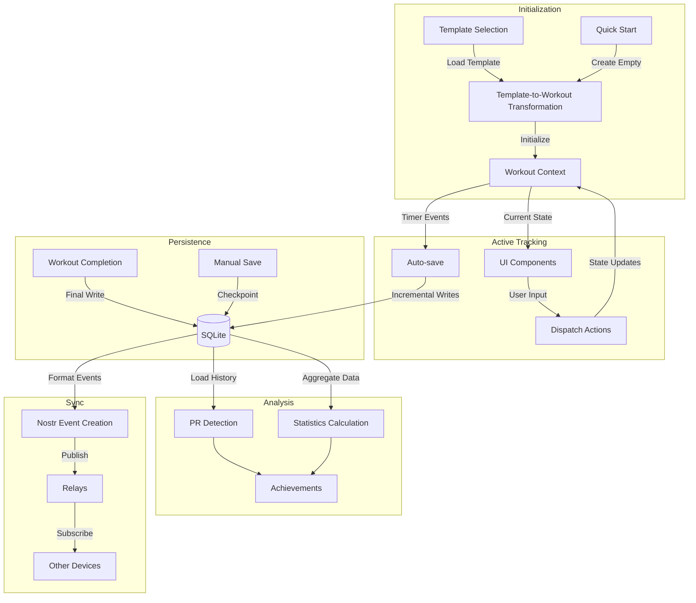

# POWR Workout Data Flow Specification

## Overview

This document outlines the complete data flow for the workout feature, from initialization through completion and storage. The design prioritizes data integrity, performance, and future extensibility with Nostr integration.

## Data Flow Diagram



## Data Transformation Stages

### 1. Template to Workout Conversion

```typescript
interface WorkoutTemplateToWorkoutParams {
  template: Template;
  workoutSettings?: {
    skipExercises?: string[];
    addExercises?: WorkoutExercise[];
    adjustRestTimes?: boolean;
    scaleWeights?: number; // Percentage multiplier
  };
}

function convertTemplateToWorkout(
  params: WorkoutTemplateToWorkoutParams
): Workout {
  // 1. Deep clone template structure
  // 2. Apply user customizations
  // 3. Initialize tracking metadata
  // 4. Generate unique IDs
  // 5. Add timestamps
}
```

Key operations:
- Exercise copies maintain reference to source exercise
- Sets are initialized with default values from template
- Additional metadata fields added for tracking
- Timestamps initialized
- IDs generated for all entities

### 2. Workout State Management

The central reducer handles all state transitions and ensures data consistency:

```typescript
function workoutReducer(
  state: WorkoutState,
  action: WorkoutAction
): WorkoutState {
  switch (action.type) {
    case 'START_WORKOUT':
      return {
        ...state,
        status: 'active',
        activeWorkout: action.payload,
        startTime: Date.now(),
        elapsedTime: 0,
      };
      
    case 'UPDATE_SET':
      const { exerciseIndex, setIndex, data } = action.payload;
      const updatedExercises = [...state.activeWorkout.exercises];
      const updatedSets = [...updatedExercises[exerciseIndex].sets];
      
      updatedSets[setIndex] = {
        ...updatedSets[setIndex],
        ...data,
        lastUpdated: Date.now(),
      };
      
      updatedExercises[exerciseIndex] = {
        ...updatedExercises[exerciseIndex],
        sets: updatedSets,
      };
      
      return {
        ...state,
        activeWorkout: {
          ...state.activeWorkout,
          exercises: updatedExercises,
          lastUpdated: Date.now(),
        },
        needsSave: true,
      };
    
    // Additional cases for all actions...
  }
}
```

### 3. Persistence Layer

Data is saved incrementally with different strategies:

```typescript
class WorkoutPersistence {
  // Save entire workout
  async saveWorkout(workout: Workout): Promise<void> {
    return this.db.withTransactionAsync(async () => {
      // 1. Save workout metadata
      // 2. Save all exercises
      // 3. Save all sets
      // 4. Update related statistics
    });
  }
  
  // Save only modified data
  async saveIncrementalChanges(workout: Workout): Promise<void> {
    const dirtyExercises = workout.exercises.filter(e => e.isDirty);
    
    return this.db.withTransactionAsync(async () => {
      // Only update changed exercises and sets
      for (const exercise of dirtyExercises) {
        // Update exercise
        // Update dirty sets
        exercise.isDirty = false;
        for (const set of exercise.sets) {
          set.isDirty = false;
        }
      }
    });
  }
}
```

Save triggers:
1. **Auto-save**: Every 30 seconds during active workout
2. **Exercise change**: When navigating between exercises
3. **Pause**: When workout is paused
4. **Completion**: Final save with additional metadata
5. **Manual save**: User-triggered save
6. **App background**: When app moves to background

### 4. Workout Completion Processing

```typescript
async function processWorkoutCompletion(workout: Workout): Promise<WorkoutSummary> {
  // 1. Mark workout as completed
  const completedWorkout = {
    ...workout,
    isCompleted: true,
    endTime: Date.now(),
  };
  
  // 2. Calculate final statistics
  const stats = calculateWorkoutStatistics(completedWorkout);
  
  // 3. Detect personal records
  const personalRecords = detectPersonalRecords(completedWorkout);
  
  // 4. Save everything to database
  await workoutPersistence.saveCompletedWorkout(
    completedWorkout,
    stats,
    personalRecords
  );
  
  // 5. Return summary data
  return {
    workout: completedWorkout,
    statistics: stats,
    achievements: {
      personalRecords,
      streaks: detectStreaks(completedWorkout),
      milestones: detectMilestones(completedWorkout),
    },
  };
}
```

### 5. Nostr Event Creation

```typescript
function createNostrWorkoutEvent(workout: CompletedWorkout): NostrEvent {
  return {
    kind: 33403, // Workout Record
    content: workout.notes || '',
    tags: [
      ['d', workout.id],
      ['title', workout.title],
      ['type', workout.type],
      ['start', workout.startTime.toString()],
      ['end', workout.endTime.toString()],
      ['completed', workout.isCompleted.toString()],
      
      // Exercise data
      ...workout.exercises.flatMap(exercise => {
        const exerciseRef = `33401:${exercise.author || 'local'}:${exercise.sourceId}`;
        
        return exercise.sets.map(set => [
          'exercise',
          exerciseRef,
          set.weight?.toString() || '',
          set.reps?.toString() || '',
          set.rpe?.toString() || '',
          set.type,
        ]);
      }),
      
      // PR tags if applicable
      ...workout.personalRecords.map(pr => [
        'pr',
        `${pr.exerciseId},${pr.metric},${pr.value}`
      ]),
      
      // Categorization tags
      ...workout.tags.map(tag => ['t', tag])
    ],
    created_at: Math.floor(workout.endTime / 1000),
  };
}
```

## Data Structures

### Workout State

```typescript
interface WorkoutState {
  status: 'idle' | 'active' | 'paused' | 'completed';
  activeWorkout: Workout | null;
  currentExerciseIndex: number;
  currentSetIndex: number;
  startTime: number | null;
  endTime: number | null;
  elapsedTime: number;
  restTimer: {
    isActive: boolean;
    duration: number;
    remaining: number;
    exerciseId?: string;
    setIndex?: number;
  };
  needsSave: boolean;
  lastSaved: number | null;
}
```

### Active Workout

```typescript
interface Workout {
  id: string;
  title: string;
  type: WorkoutType;
  startTime: number;
  endTime?: number;
  isCompleted: boolean;
  templateId?: string;
  exercises: WorkoutExercise[];
  notes?: string;
  tags: string[];
  lastUpdated: number;
}

interface WorkoutExercise {
  id: string;
  sourceId: string; // Reference to exercise definition
  title: string;
  sets: WorkoutSet[];
  notes?: string;
  isDirty: boolean;
  isCompleted: boolean;
  order: number;
  restTime?: number;
}

interface WorkoutSet {
  id: string;
  setNumber: number;
  type: SetType;
  weight?: number;
  reps?: number;
  rpe?: number;
  isCompleted: boolean;
  isDirty: boolean;
  timestamp?: number;
  notes?: string;
}
```

### Workout Summary

```typescript
interface WorkoutSummary {
  id: string;
  title: string;
  type: WorkoutType;
  duration: number; // In milliseconds
  startTime: number;
  endTime: number;
  exerciseCount: number;
  completedExercises: number;
  totalVolume: number;
  totalReps: number;
  averageRpe?: number;
  exerciseSummaries: ExerciseSummary[];
  personalRecords: PersonalRecord[];
}

interface ExerciseSummary {
  exerciseId: string;
  title: string;
  setCount: number;
  completedSets: number;
  volume: number;
  peakWeight?: number;
  totalReps: number;
  averageRpe?: number;
}
```

## SQLite Schema Integration

Building on the existing schema, these additional tables and relationships will be needed:

```sql
-- Workout-specific schema extensions

-- Active workout tracking
CREATE TABLE IF NOT EXISTS active_workouts (
  id TEXT PRIMARY KEY,
  title TEXT NOT NULL,
  type TEXT NOT NULL,
  start_time INTEGER NOT NULL,
  last_updated INTEGER NOT NULL,
  template_id TEXT,
  metadata TEXT, -- JSON blob of additional data
  FOREIGN KEY(template_id) REFERENCES templates(id)
);

-- Completed workouts
CREATE TABLE IF NOT EXISTS completed_workouts (
  id TEXT PRIMARY KEY,
  title TEXT NOT NULL,
  type TEXT NOT NULL,
  start_time INTEGER NOT NULL,
  end_time INTEGER NOT NULL,
  duration INTEGER NOT NULL, -- In milliseconds
  total_volume REAL,
  total_reps INTEGER,
  average_rpe REAL,
  notes TEXT,
  template_id TEXT,
  nostr_event_id TEXT,
  FOREIGN KEY(template_id) REFERENCES templates(id)
);

-- Individual workout exercises
CREATE TABLE IF NOT EXISTS workout_exercises (
  id TEXT PRIMARY KEY,
  workout_id TEXT NOT NULL,
  exercise_id TEXT NOT NULL,
  position INTEGER NOT NULL,
  is_completed BOOLEAN DEFAULT 0,
  notes TEXT,
  rest_time INTEGER, -- In seconds
  FOREIGN KEY(workout_id) REFERENCES active_workouts(id) ON DELETE CASCADE,
  FOREIGN KEY(exercise_id) REFERENCES exercises(id)
);

-- Set data
CREATE TABLE IF NOT EXISTS workout_sets (
  id TEXT PRIMARY KEY,
  workout_exercise_id TEXT NOT NULL,
  set_number INTEGER NOT NULL,
  weight REAL,
  reps INTEGER,
  rpe REAL,
  completed BOOLEAN DEFAULT 0,
  set_type TEXT NOT NULL,
  timestamp INTEGER,
  notes TEXT,
  FOREIGN KEY(workout_exercise_id) REFERENCES workout_exercises(id) ON DELETE CASCADE
);

-- Personal records
CREATE TABLE IF NOT EXISTS personal_records (
  id TEXT PRIMARY KEY,
  exercise_id TEXT NOT NULL,
  metric TEXT NOT NULL, -- 'weight', 'reps', 'volume', etc.
  value REAL NOT NULL,
  workout_id TEXT NOT NULL,
  achieved_at INTEGER NOT NULL,
  FOREIGN KEY(exercise_id) REFERENCES exercises(id) ON DELETE CASCADE,
  FOREIGN KEY(workout_id) REFERENCES completed_workouts(id)
);

-- Workout tags
CREATE TABLE IF NOT EXISTS workout_tags (
  workout_id TEXT NOT NULL,
  tag TEXT NOT NULL,
  FOREIGN KEY(workout_id) REFERENCES completed_workouts(id) ON DELETE CASCADE,
  PRIMARY KEY(workout_id, tag)
);

-- Workout statistics
CREATE TABLE IF NOT EXISTS workout_statistics (
  workout_id TEXT PRIMARY KEY,
  stats_json TEXT NOT NULL, -- Flexible JSON storage for various metrics
  calculated_at INTEGER NOT NULL,
  FOREIGN KEY(workout_id) REFERENCES completed_workouts(id) ON DELETE CASCADE
);
```

## Optimization Strategies

### 1. Batch Processing

For performance-critical operations, batch updates are used:

```typescript
// Instead of individual operations
async function saveSetsIndividually(sets: WorkoutSet[]) {
  for (const set of sets) {
    await db.runAsync(
      'UPDATE workout_sets SET weight = ?, reps = ?, completed = ? WHERE id = ?',
      [set.weight, set.reps, set.isCompleted, set.id]
    );
  }
}

// Use batch operations
async function saveSetsInBatch(sets: WorkoutSet[]) {
  if (sets.length === 0) return;
  
  const placeholders = sets.map(() => '(?, ?, ?, ?, ?, ?, ?)').join(', ');
  const values = sets.flatMap(set => [
    set.id,
    set.workout_exercise_id,
    set.set_number,
    set.weight || null,
    set.reps || null,
    set.rpe || null,
    set.isCompleted ? 1 : 0
  ]);
  
  await db.runAsync(`
    INSERT OR REPLACE INTO workout_sets 
    (id, workout_exercise_id, set_number, weight, reps, rpe, completed)
    VALUES ${placeholders}
  `, values);
}
```

### 2. Dirty Tracking

Optimize saves by only updating changed data:

```typescript
function markDirty(entity: { isDirty?: boolean, lastUpdated?: number }) {
  entity.isDirty = true;
  entity.lastUpdated = Date.now();
}

// In reducer
case 'UPDATE_SET': {
  const { exerciseIndex, setIndex, data } = action.payload;
  const updatedExercises = [...state.activeWorkout.exercises];
  const updatedSets = [...updatedExercises[exerciseIndex].sets];
  
  // Only mark as dirty if actually changed
  const currentSet = updatedSets[setIndex];
  const hasChanged = Object.entries(data).some(
    ([key, value]) => currentSet[key] !== value
  );
  
  if (hasChanged) {
    updatedSets[setIndex] = {
      ...updatedSets[setIndex],
      ...data,
      isDirty: true,
      lastUpdated: Date.now(),
    };
    
    updatedExercises[exerciseIndex] = {
      ...updatedExercises[exerciseIndex],
      sets: updatedSets,
      isDirty: true,
      lastUpdated: Date.now(),
    };
  }
  
  return {
    ...state,
    activeWorkout: {
      ...state.activeWorkout,
      exercises: updatedExercises,
      lastUpdated: hasChanged ? Date.now() : state.activeWorkout.lastUpdated,
    },
    needsSave: hasChanged,
  };
}
```

### 3. Incremental Auto-save

```typescript
function useAutoSave(
  workout: Workout | null,
  needsSave: boolean,
  saveWorkout: (workout: Workout) => Promise<void>
) {
  const [lastSaveTime, setLastSaveTime] = useState<number | null>(null);
  const saveIntervalRef = useRef<NodeJS.Timeout | null>(null);
  
  useEffect(() => {
    if (!workout) return;
    
    // Set up interval for periodic saves
    saveIntervalRef.current = setInterval(() => {
      if (workout && needsSave) {
        saveWorkout(workout)
          .then(() => setLastSaveTime(Date.now()))
          .catch(err => console.error('Auto-save failed:', err));
      }
    }, 30000); // 30 seconds
    
    return () => {
      if (saveIntervalRef.current) {
        clearInterval(saveIntervalRef.current);
      }
    };
  }, [workout, needsSave, saveWorkout]);
  
  // Additional save on app state changes
  useAppState(
    (nextAppState) => {
      if (nextAppState === 'background' && workout && needsSave) {
        saveWorkout(workout)
          .then(() => setLastSaveTime(Date.now()))
          .catch(err => console.error('Background save failed:', err));
      }
    }
  );
  
  return lastSaveTime;
}
```

## Error Handling and Recovery

### 1. Save Failure Recovery

```typescript
async function saveWithRetry(
  workout: Workout,
  maxRetries = 3
): Promise<boolean> {
  let attempts = 0;
  
  while (attempts < maxRetries) {
    try {
      await workoutPersistence.saveWorkout(workout);
      return true;
    } catch (error) {
      attempts++;
      console.error(`Save failed (attempt ${attempts}):`, error);
      
      if (attempts >= maxRetries) {
        // Create emergency backup
        await createEmergencyBackup(workout);
        notifyUser('Workout save failed. Emergency backup created.');
        return false;
      }
      
      // Exponential backoff
      await new Promise(resolve => 
        setTimeout(resolve, 1000 * Math.pow(2, attempts))
      );
    }
  }
  
  return false;
}

async function createEmergencyBackup(workout: Workout): Promise<void> {
  try {
    const backupJson = JSON.stringify(workout);
    const timestamp = new Date().toISOString().replace(/[:.]/g, '-');
    const filename = `workout-backup-${timestamp}.json`;
    await FileSystem.writeAsStringAsync(
      `${FileSystem.documentDirectory}backups/${filename}`,
      backupJson
    );
  } catch (e) {
    console.error('Emergency backup failed:', e);
  }
}
```

### 2. Crash Recovery

```typescript
async function checkForUnfinishedWorkouts(): Promise<Workout | null> {
  try {
    const activeWorkouts = await db.getAllAsync<ActiveWorkoutRow>(
      'SELECT * FROM active_workouts WHERE end_time IS NULL'
    );
    
    if (activeWorkouts.length === 0) return null;
    
    // Find most recent active workout
    const mostRecent = activeWorkouts.reduce((latest, current) => 
      current.last_updated > latest.last_updated ? current : latest
    );
    
    // Reconstruct full workout object
    return reconstructWorkoutFromDatabase(mostRecent.id);
  } catch (error) {
    console.error('Error checking for unfinished workouts:', error);
    return null;
  }
}

function useWorkoutRecovery() {
  const [recoveryWorkout, setRecoveryWorkout] = useState<Workout | null>(null);
  const [showRecoveryDialog, setShowRecoveryDialog] = useState(false);
  
  useEffect(() => {
    const checkRecovery = async () => {
      const unfinishedWorkout = await checkForUnfinishedWorkouts();
      if (unfinishedWorkout) {
        setRecoveryWorkout(unfinishedWorkout);
        setShowRecoveryDialog(true);
      }
    };
    
    checkRecovery();
  }, []);
  
  const handleRecovery = (shouldRecover: boolean) => {
    if (shouldRecover && recoveryWorkout) {
      // Resume workout
      dispatch({ 
        type: 'RECOVER_WORKOUT', 
        payload: recoveryWorkout 
      });
    } else if (recoveryWorkout) {
      // Discard unfinished workout
      workoutPersistence.discardWorkout(recoveryWorkout.id);
    }
    
    setShowRecoveryDialog(false);
  };
  
  return {
    showRecoveryDialog,
    recoveryWorkout,
    handleRecovery
  };
}
```

## Nostr Integration

### 1. Event Publishing

```typescript
async function publishWorkoutToNostr(workout: CompletedWorkout): Promise<string> {
  try {
    // Convert to Nostr event format
    const event = createNostrWorkoutEvent(workout);
    
    // Sign event
    const signedEvent = await ndk.signer.sign(event);
    
    // Publish to relays
    await ndk.publish(signedEvent);
    
    // Update local record with event ID
    await db.runAsync(
      'UPDATE completed_workouts SET nostr_event_id = ? WHERE id = ?',
      [signedEvent.id, workout.id]
    );
    
    return signedEvent.id;
  } catch (error) {
    console.error('Failed to publish workout to Nostr:', error);
    throw error;
  }
}
```

### 2. Subscription Integration

```typescript
function subscribeToWorkoutEvents() {
  // Subscribe to workout events from followed users
  const filter = {
    kinds: [33401, 33402, 33403],
    authors: followedPubkeys,
    since: lastSyncTimestamp
  };
  
  const subscription = ndk.subscribe(filter);
  
  subscription.on('event', (event) => {
    try {
      processIncomingNostrEvent(event);
    } catch (error) {
      console.error('Error processing incoming event:', error);
    }
  });
  
  return subscription;
}

async function processIncomingNostrEvent(event: NostrEvent) {
  switch (event.kind) {
    case 33401: // Exercise definition
      await processExerciseDefinition(event);
      break;
    
    case 33402: // Workout template
      await processWorkoutTemplate(event);
      break;
    
    case 33403: // Workout record
      await processWorkoutRecord(event);
      break;
  }
}
```

## Metrics and Analytics

```typescript
interface WorkoutMetrics {
  // Time metrics
  totalDuration: number;
  exerciseTime: number;
  restTime: number;
  averageSetDuration: number;
  
  // Volume metrics
  totalVolume: number;
  volumeByExercise: Record<string, number>;
  volumeByMuscleGroup: Record<string, number>;
  
  // Intensity metrics
  averageRpe: number;
  peakRpe: number;
  intensityDistribution: {
    low: number;    // Sets with RPE 1-4
    medium: number; // Sets with RPE 5-7
    high: number;   // Sets with RPE 8-10
  };
  
  // Completion metrics
  exerciseCompletionRate: number;
  setCompletionRate: number;
  plannedVsActualVolume: number;
}

function calculateWorkoutMetrics(workout: CompletedWorkout): WorkoutMetrics {
  // Implementation of metric calculations
  // ...
  
  return metrics;
}
```

## Data Flow Timeline

1. **Workout Initialization** (t=0)
   - Template loaded or empty workout created
   - Initial state populated
   - Workout ID generated
   - Database record created
   
2. **Active Tracking** (t=0 → completion)
   - User inputs captured through reducers
   - State updates trigger UI refreshes
   - Dirty tracking flags changes
   - Auto-save runs periodically
   
3. **Exercise Transitions**
   - Current exercise state saved
   - Next exercise loaded
   - Progress indicators updated
   
4. **Completion Processing**
   - Final state saving
   - Statistics calculation
   - PR detection
   - Achievement unlocking
   
5. **Post-Workout** 
   - History update
   - Nostr publishing (if enabled)
   - Cleanup of temporary data

## Integration with Existing Architecture

The workout data flow integrates with existing systems:

1. **Library System** - Templates loaded from library
2. **User Profiles** - PRs and achievements tied to user
3. **Social Features** - Workout sharing via Nostr
4. **History Tab** - Completed workouts appear in history
5. **Exercise Database** - Exercise references maintained

## Future Extensibility

This design supports future enhancements:

1. **AI Recommendations** - Data structured for ML analysis
2. **External Device Integration** - Schema allows for sensor data
3. **Advanced Periodization** - Tracking supports long-term planning
4. **Video Analysis** - Form tracking integration points
5. **Multi-user Workouts** - Shared workout capabilities