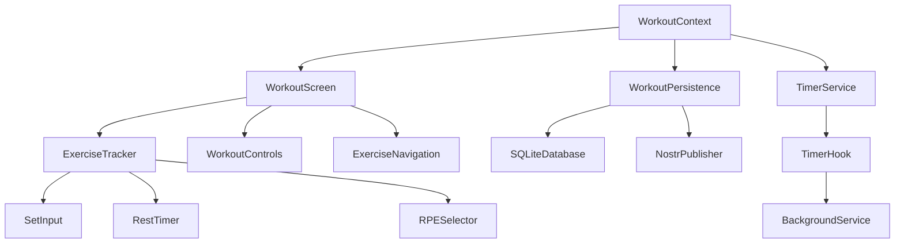
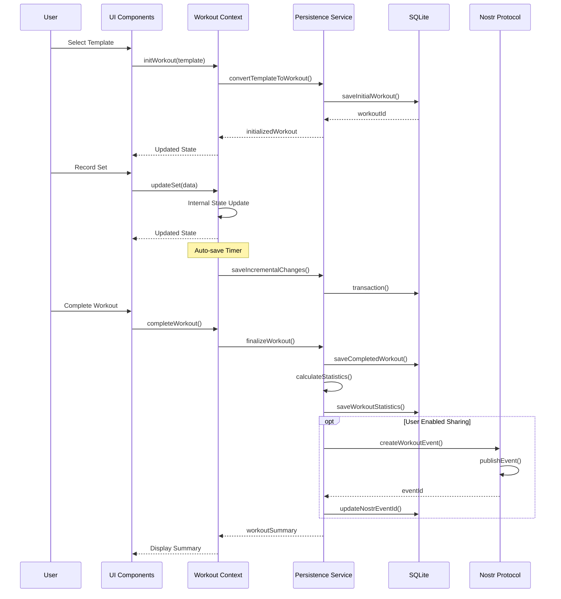

# POWR Workout Implementation Roadmap

## Overview

This roadmap outlines the phased implementation approach for the POWR Workout feature. The development is structured in progressive iterations, each building upon the previous while maintaining usable functionality at each stage.

## Phase 0: Preparation (1-2 days)

### Database Schema Extensions
- Update SQLite schema with workout tables
- Create migration scripts
- Add test data validation

### TypeScript Definitions
- Define core workout interfaces
- Create type guards and utility functions
- Document relationships with existing types

### Testing Infrastructure
- Set up workout component testing environment
- Create mock workout data generators
- Establish performance benchmarks

## Phase 1: Core Workout Infrastructure (1 week)

### Workout Context & State Management
- [ ] Create WorkoutContext and provider
- [ ] Implement workout reducer
- [ ] Build timer hook implementation
- [ ] Add persistence service

### Basic UI Components
- [ ] Workout setup screen
- [ ] Basic exercise tracking interface
- [ ] Simple completion flow
- [ ] Minimal workout summary

### Database Integration
- [ ] Basic CRUD operations for workouts
- [ ] Template-to-workout conversion
- [ ] Simple workout history storage

### Testing
- [ ] Unit tests for core logic
- [ ] Basic UI component tests
- [ ] Database operation tests

**Milestone:** Users can start a basic workout, track sets/reps, and save results

## Phase 2: Enhanced Tracking Experience (1 week)

### Advanced UI Components
- [ ] Rest timer implementation
- [ ] Exercise navigation carousel
- [ ] Set tracker with history reference
- [ ] In-workout notes and feedback
- [ ] Enhanced number inputs for weight/reps

### Workout Types Support
- [ ] Strength workout layout
- [ ] Circuit workout support
- [ ] EMOM timer integration
- [ ] AMRAP tracking

### Progress Tracking
- [ ] Basic PR detection
- [ ] Set completion visualization
- [ ] Progress indicators
- [ ] Exercise history comparison

### Data Persistence
- [ ] Optimized auto-save
- [ ] Crash recovery
- [ ] Workout modification tracking

**Milestone:** Full-featured workout tracking with specialized workout types

## Phase 3: Performance & Analysis (1 week)

### Performance Optimization
- [ ] Reduce render cycles
- [ ] Optimize database operations
- [ ] Efficient timer implementation
- [ ] Memory usage optimization

### Workout Analysis
- [ ] Comprehensive statistics calculation
- [ ] Volume tracking by muscle group
- [ ] Intensity analysis
- [ ] Trend visualization

### Advanced Features
- [ ] Workout templates with progression
- [ ] RPE guidance
- [ ] Rest period recommendations
- [ ] Supersets and complex exercise grouping

### Enhanced Recovery
- [ ] Automated backup system
- [ ] Unfinished workout detection
- [ ] Cross-session recovery

**Milestone:** Optimized workout experience with rich analytics

## Phase 4: Social & Nostr Integration (1 week)

### Nostr Event Creation
- [ ] Exercise event formatting (kind: 33401)
- [ ] Template event formatting (kind: 33402)
- [ ] Workout record event formatting (kind: 33403)

### Publishing Flow
- [ ] Privacy-aware publishing options
- [ ] Selective publishing (exercises vs workouts)
- [ ] Author attribution

### Subscription Integration
- [ ] Followed user workout display
- [ ] Workout import from Nostr
- [ ] Social interactions (reactions, comments)

### Multi-device Sync
- [ ] Workout continuation across devices
- [ ] Template synchronization
- [ ] History consolidation

**Milestone:** Social workout sharing and multi-device capabilities

## Phase 5: Polish & Advanced Features (1-2 weeks)

### UI Polish
- [ ] Animations and transitions
- [ ] Haptic feedback integration
- [ ] Sound cues for timers
- [ ] Improved visual design

### User Experience Improvements
- [ ] Onboarding flow for workout tracking
- [ ] Contextual help and tips
- [ ] Customizable workout controls
- [ ] Accessibility enhancements

### Advanced Tracking Options
- [ ] Custom exercise metrics
- [ ] Video form recording
- [ ] Voice notes during workout
- [ ] Workout photos

### Integration Enhancements
- [ ] Calendar integration
- [ ] Health kit/Google Fit synchronization
- [ ] Export capabilities
- [ ] Sharing to non-Nostr platforms

**Milestone:** Polished, feature-complete workout experience

## Implementation Approach

### Vertical Slices
Each phase will implement features as complete vertical slices, ensuring working functionality at each stage. This approach allows for:

1. Earlier user testing and feedback
2. Incremental value delivery
3. More flexible priorities
4. Easier integration testing

### Testing Strategy
- Unit tests for all core logic components
- Component tests for UI elements
- Integration tests for data flow
- E2E tests for critical user journeys
- Performance tests for timer accuracy

### Quality Gates
Each phase must meet these criteria before proceeding:
1. All tests passing
2. Performance benchmarks met
3. No regressions in existing functionality
4. Technical debt documented
5. Documentation updated

## Resource Requirements

### Development Team
- 1-2 React Native developers
- 1 Designer for UI components
- Testing support

### Technical Resources
- Test devices (iOS/Android)
- Performance monitoring setup
- SQLite optimization tools
- Animation prototyping tools

### External Dependencies
- Nostr SDK updates if needed
- Any third-party libraries for specific features
- Design system extensions

## Risk Management

### Identified Risks
1. **Timer Accuracy** - Mobile timers may drift or be affected by background state
   - *Mitigation:* Use requestAnimationFrame and background-aware implementations
   
2. **Database Performance** - Large workout histories may impact query speed
   - *Mitigation:* Implement pagination, indexing, and query optimization
   
3. **Cross-platform Consistency** - UI/interaction differences between iOS/Android/web
   - *Mitigation:* Platform-specific adaptations while maintaining consistent data model
   
4. **Offline Sync Conflicts** - Multi-device usage may cause data conflicts
   - *Mitigation:* Implement conflict resolution strategies and versioning

5. **Battery Usage** - Continuous timing and tracking may impact battery life
   - *Mitigation:* Optimize refresh rates, background processes, and sensor usage

## Success Metrics

### User Engagement
- Workout completion rate
- Average workout duration
- Return rate to workout feature
- Template reuse rate

### Performance
- Time to interactive for workout screen
- Save operation duration
- Timer accuracy
- Battery impact

### Quality
- Crash-free sessions
- Data preservation rate
- Auto-recovery success rate
- Cross-device consistency

## Future Roadmap Considerations

### Phase 6: Advanced Analytics
- Machine learning for workout recommendations
- Fatigue analysis
- Progression optimization
- Long-term trend visualization

### Phase 7: Community Features
- Workout challenges
- Leaderboards
- Group workouts
- Coach/client relationships

### Phase 8: Premium Features
- Advanced workout programming
- AI form checking
- Premium templates
- Personalized insights

## Appendix: Component Dependencies

## Appendix: Data Flow Diagram

## Appendix: Test Matrix

| Component | Unit Tests | Integration Tests | E2E Tests | Performance Tests |
|-----------|------------|-------------------|-----------|-------------------|
| Workout Context | State transitions, Timer accuracy | Data flow, Component integration | - | Memory usage |
| Exercise Tracking | Input validation, UI state | Database integration | Full workout flow | Render performance |
| Rest Timer | Timing accuracy, State management | UI integration | - | Background behavior |
| Database | CRUD operations | Recovery, Transaction integrity | - | Query performance |
| Nostr Integration | Event formatting | Publishing flow | Cross-device sync | Network efficiency |
| UI Components | Rendering, Props validation | Context integration | User interactions | Animation smoothness |