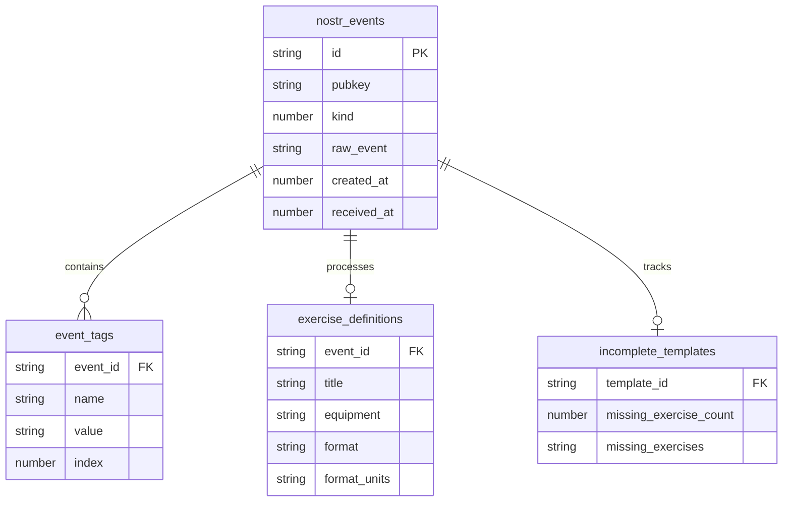
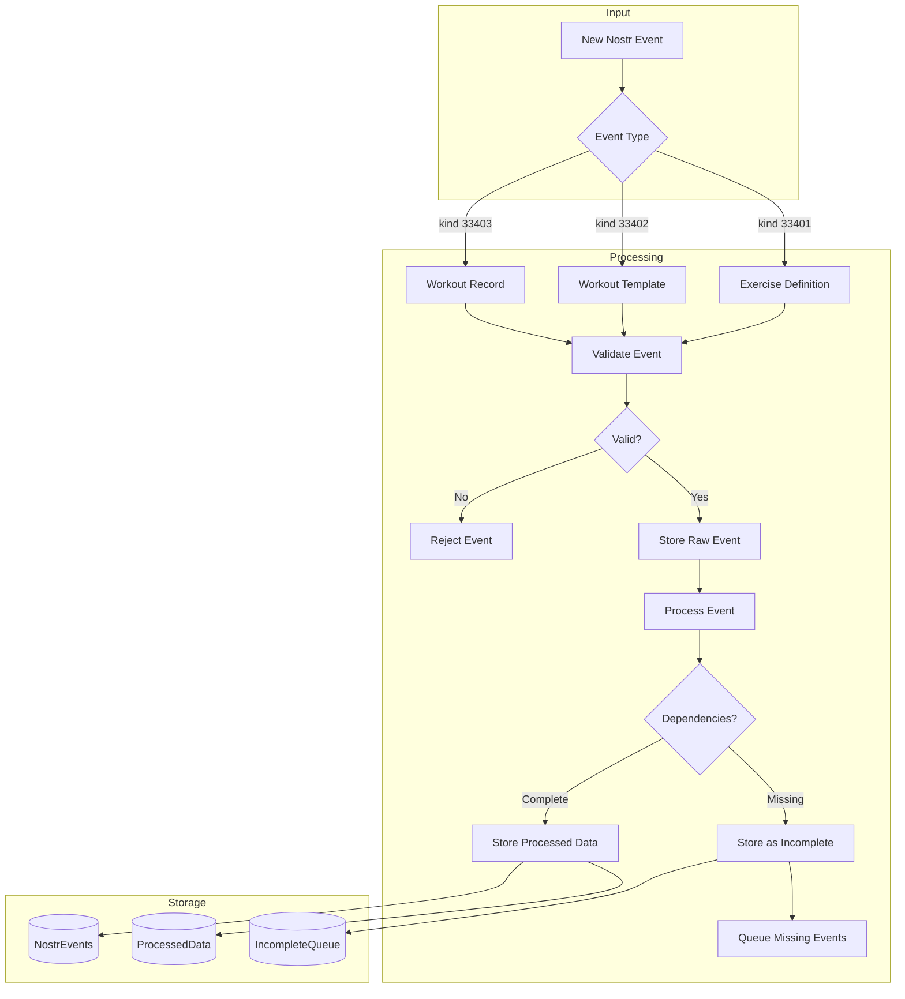
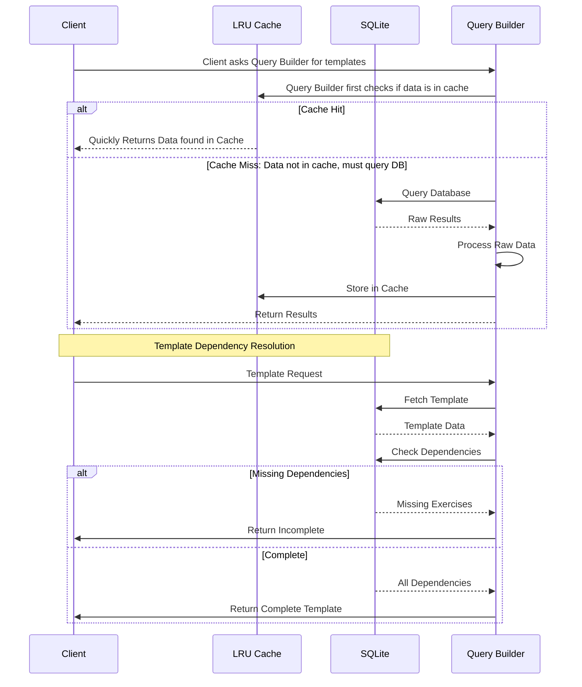
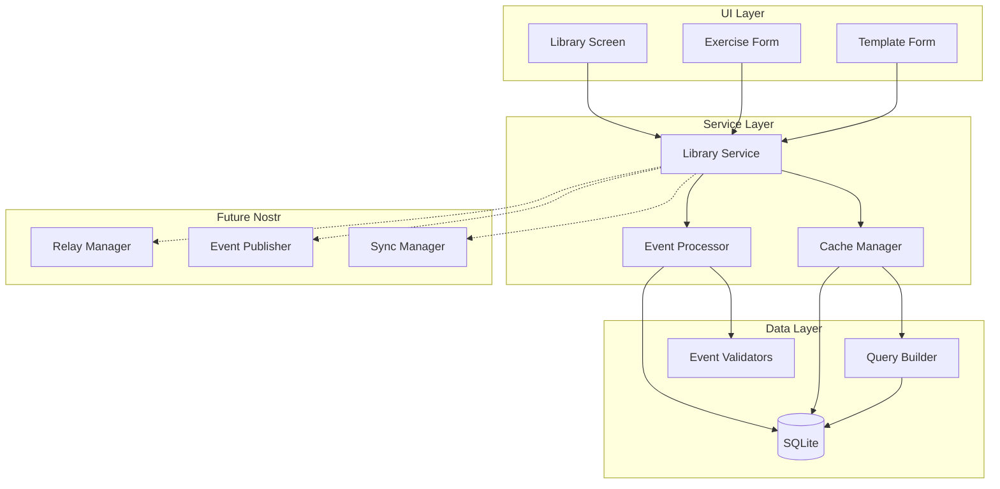

# POWR Database Architecture Diagrams

## 1. Entity Relationship Diagram

This diagram shows the core database structure and relationships between tables. The design supports both raw Nostr event storage and processed data for efficient querying.

Key Features:
- Raw Nostr event storage in `nostr_events`
- Processed exercise data in `exercise_definitions`
- Dependency tracking in `incomplete_templates`
- Efficient tag indexing in `event_tags`

## 2. Event Processing Flow

This diagram illustrates how different types of Nostr events (Exercise Definitions, Workout Templates, and Workout Records) are processed, validated, and stored.

Key Features:
- Event type differentiation
- Validation process
- Dependency checking
- Storage paths for complete/incomplete data

## 3. Query and Cache Flow

This sequence diagram shows how data is retrieved, utilizing the LRU cache for performance and handling template dependencies.

Key Features:
- Cache hit/miss handling
- Template dependency resolution
- Efficient data retrieval paths
- Incomplete template handling
- Solid line with arrow (->>) means "makes a request to"
- Dashed line (-->) means "returns data to"

The second part shows template dependency resolution:
- Template request process
- Dependency checking
- Different responses based on whether all exercises exist
The key learning points:
- Cache is checked first to improve performance
- Database is only queried if necessary
- Results are cached for future use
- Dependencies are verified before returning complete templates

## 4. Component Architecture

This diagram shows the overall application architecture, including service layers and future Nostr integration points.

Key Features:
- Clear layer separation
- Service interactions
- Cache management
- Future Nostr integration points

## Implementation Notes

These diagrams represent the core architecture of POWR's database implementation. Key considerations:

1. **Data Flow**
   - All Nostr events are stored in raw form
   - Processed data is stored separately for efficiency
   - Cache layer improves read performance
   - Dependency tracking ensures data integrity

2. **Scalability**
   - Modular design allows for future expansion
   - Clear separation of concerns
   - Efficient query patterns
   - Prepared for Nostr integration

3. **Performance**
   - LRU caching for frequent queries
   - Optimized indexes for common operations
   - Efficient dependency resolution
   - Batch processing capability