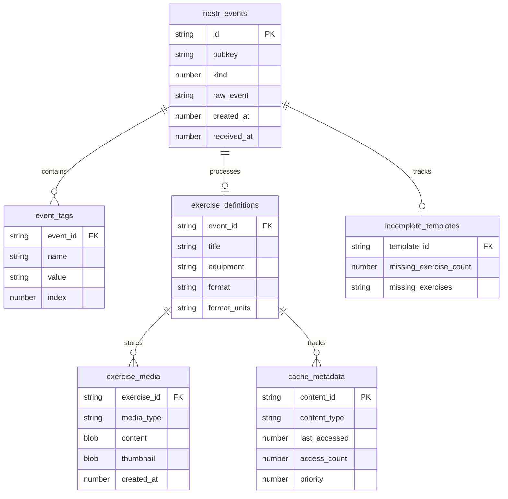
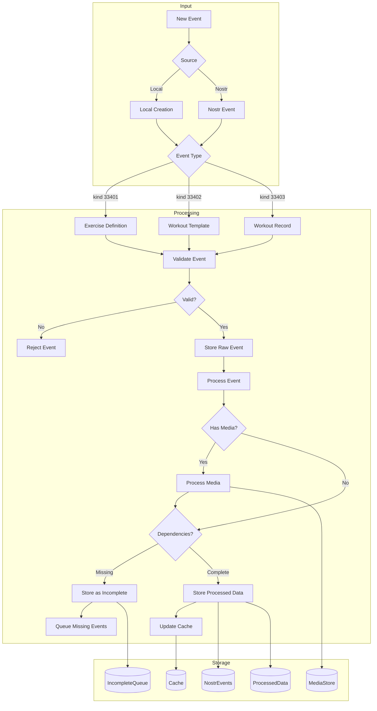
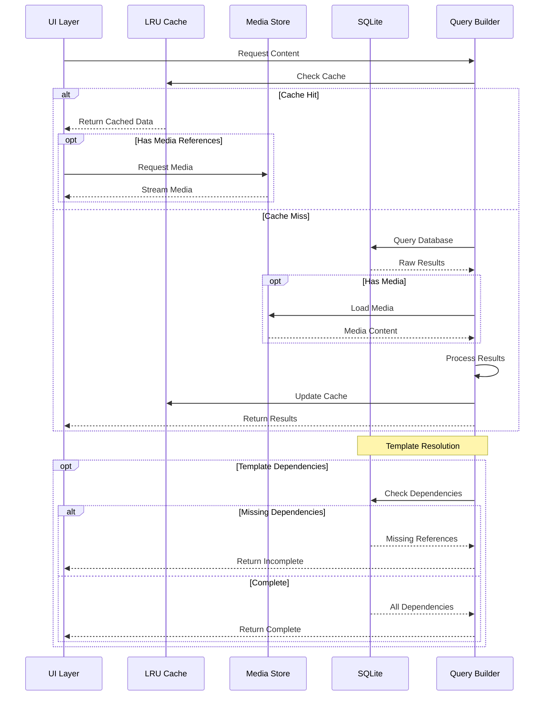
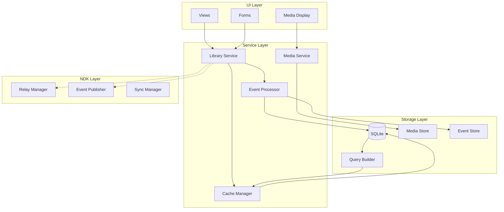

# POWR Database Architecture

## 1. Entity Relationship Diagram

This diagram shows the core database structure and relationships between tables. The design supports both local-first operations with performance optimizations and Nostr protocol integration.

Key Features:
- Raw Nostr event storage in `nostr_events`
- Processed exercise data in `exercise_definitions`
- Media content storage in `exercise_media`
- Cache management in `cache_metadata`
- Dependency tracking in `incomplete_templates`
- Efficient tag indexing in `event_tags`

## 2. Event Processing Flow

This diagram illustrates how both local and Nostr events are processed, validated, and stored. The system handles Exercise Definitions (33401), Workout Templates (33402), and Workout Records (33403).

Key Features:
- Support for both local and Nostr events
- Unified validation process
- Media content handling
- Cache management
- Dependency checking
- Storage optimization

## 3. Query and Cache Flow

This sequence diagram shows how data is retrieved, using a performance-optimized approach with LRU caching, efficient media handling, and template dependency resolution.

Key Features:
- Smart cache management
- Media streaming
- Template dependency resolution
- Query optimization
- Priority-based caching

## 4. Component Architecture

This diagram shows the application architecture, focusing on the interaction between local-first operations and Nostr integration.

Key Features:
- Local-first prioritization
- Efficient service layers
- Clear data boundaries
- Performance optimization
- NDK integration points

## Implementation Notes

These diagrams represent POWR's database implementation with a focus on local-first performance while maintaining Nostr compatibility.

1. **Local-First Design**
   - SQLite as primary storage
   - Efficient caching layer
   - Optimized media handling
   - Smart query patterns
   - Background processing

2. **Nostr Integration**
   - Raw event preservation
   - NDK compatibility
   - Event validation
   - Dependency tracking
   - Sync management

3. **Performance Features**
   - LRU caching with priorities
   - Media optimization
   - Query optimization
   - Batch processing
   - Background sync

4. **Data Integrity**
   - Transaction management
   - Dependency tracking
   - Event validation
   - Error handling
   - Recovery procedures