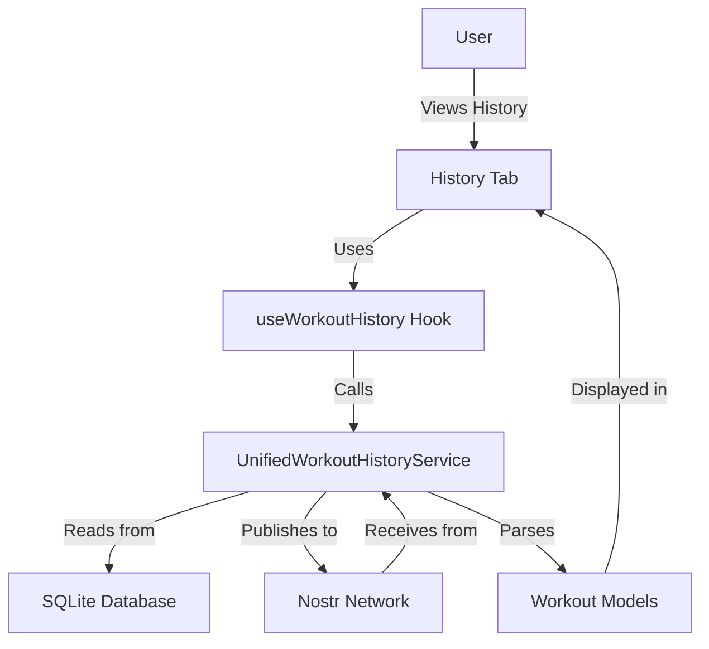
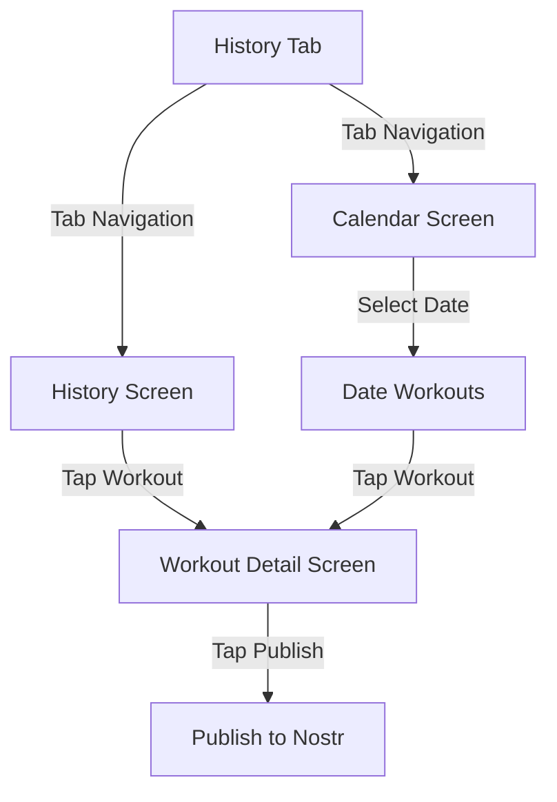

# Workout History Overview

**Last Updated:** 2025-04-02  
**Status:** Implemented  
**Related To:** [Workout Data Models](../workout/data_models.md), [Nostr Integration](../../technical/nostr/offline_queue.md)

## Introduction

The History tab provides a comprehensive view of a user's workout history, allowing them to track, review, and analyze their past workouts. It offers both chronological and calendar views, with filtering and search capabilities to help users quickly find specific workout information.

## Features

| Feature | Status | Notes |
|---------|--------|-------|
| Chronological History List | ✅ Implemented | Groups workouts by month |
| Calendar View | ✅ Implemented | Highlights dates with workouts |
| Nostr Integration | ✅ Implemented | Two-way synchronization of workout data |
| Workout Source Filtering | ✅ Implemented | Toggle between all or local-only workouts |
| Workout Detail View | ✅ Implemented | Shows complete exercise and set information |
| Pull-to-refresh | ✅ Implemented | Loads latest workouts |
| Date-based Workout Filtering | ✅ Implemented | Shows workouts for selected calendar date |
| Advanced Search | ⏳ Planned | Will search by exercise, notes, and other fields |
| Export Functionality | 🧪 Implemented (Backend) | API ready but not exposed in UI |
| Streak Tracking | 🧪 Implemented (Backend) | Service implemented but not in UI |

## Architecture

The History tab is built on a unified history service architecture that provides a consistent interface for accessing workout data from both local storage and the Nostr network.

### Components

1. **UnifiedWorkoutHistoryService**: Core service that handles all workout history operations
2. **useWorkoutHistory**: React hook that provides access to workout history functionality
3. **WorkoutCard**: Reusable component for displaying workout summary information
4. **WorkoutDetailView**: Component for displaying detailed workout information

### Data Flow

## Screens

### History Screen

The History screen displays workouts in a chronological list, grouped by month. It provides filtering options and integration with Nostr.

Key features:
- Monthly grouping for easy navigation
- Clear workout cards with exercise summaries
- Workout source filtering (All/Local Only)
- Nostr authentication prompt for unauthenticated users
- Pull-to-refresh functionality
- Visual indicators for workout source

### Calendar Screen

The Calendar screen provides a monthly calendar view with highlights for days that have workouts. Selecting a date shows the workouts for that day.

Key features:
- Monthly calendar navigation
- Visual indicators for days with workouts
- Selected date highlighting
- Detailed workout list for selected date
- Pull-to-refresh functionality
- Fallback filtering for dates without direct database matches

## Implementation Details

### Unified Service

The UnifiedWorkoutHistoryService combines functionality previously spread across multiple services into a single, comprehensive API:

- Basic CRUD operations for workout history
- Filtering and search capabilities
- Calendar and date-based queries
- Nostr integration for cross-device synchronization
- Export functionality
- Analytics and streak tracking

### Authentication State Handling

The History tab adapts to the user's authentication state, showing appropriate UI:

- **Unauthenticated**: Shows local workouts only with a login prompt
- **Authenticated**: Shows all workouts with filtering options

### Nostr Integration

Workout history integrates with Nostr for cross-device synchronization:

- Two-way synchronization of workout data
- Real-time subscription for workout updates
- Visual indicators for workout source (local/Nostr)
- Publishing capabilities for local workouts
- Import functionality for Nostr-only workouts

### Offline Support

The History tab provides robust offline support:

- Local storage of workout data
- Offline viewing of previously loaded workouts
- Background synchronization when connectivity is restored
- Visual indicators for offline state

## User Experience

### Visual Design

The History tab uses consistent visual design elements to enhance usability:

- **Color Coding**: Purple for Nostr-related elements
- **Card Layout**: Clear, consistent workout cards with exercise summaries
- **Typography**: Hierarchical text styles for improved readability
- **Iconography**: Consistent icons for actions and status indicators

### Navigation Flow

## Future Enhancements

The following enhancements are planned for future releases:

1. **Advanced Search**: Full-text search across workout titles, exercises, and notes
2. **UI for Export Functionality**: User interface for exporting workout data in CSV or JSON formats
3. **Streak Visualization**: Visual representation of workout streaks
4. **Enhanced Filtering**: More granular filtering by exercise type, duration, and intensity
5. **Analytics Integration**: Better integration with the Profile tab's analytics features
6. **Batch Operations**: Ability to perform operations on multiple workouts at once
7. **Advanced Calendar View**: Heatmap visualization of workout intensity on the calendar

## Technical Considerations

### Performance Optimization

The History tab implements several performance optimizations:

- Lazy loading of workouts for better initial load times
- Optimistic UI updates for better user experience
- Efficient SQL queries with proper indexing
- Memoization of expensive calculations
- Background data loading for calendar view

### Error Handling

Robust error handling ensures a smooth user experience:

- Fallback mechanisms for database query failures
- Graceful degradation during network issues
- Appropriate error messaging
- Retry mechanisms for failed network operations
- Data validation before storage

## Related Documentation

- [Migration Guide](./migration_guide.md) - Guide for migrating from legacy workout history services
- [Workout Data Models](../workout/data_models.md) - Details on workout data structures
- [Nostr Offline Queue](../../technical/nostr/offline_queue.md) - Information on offline Nostr functionality
- [Profile Progress Tracking](../profile/progress_tracking.md) - Related analytics features
