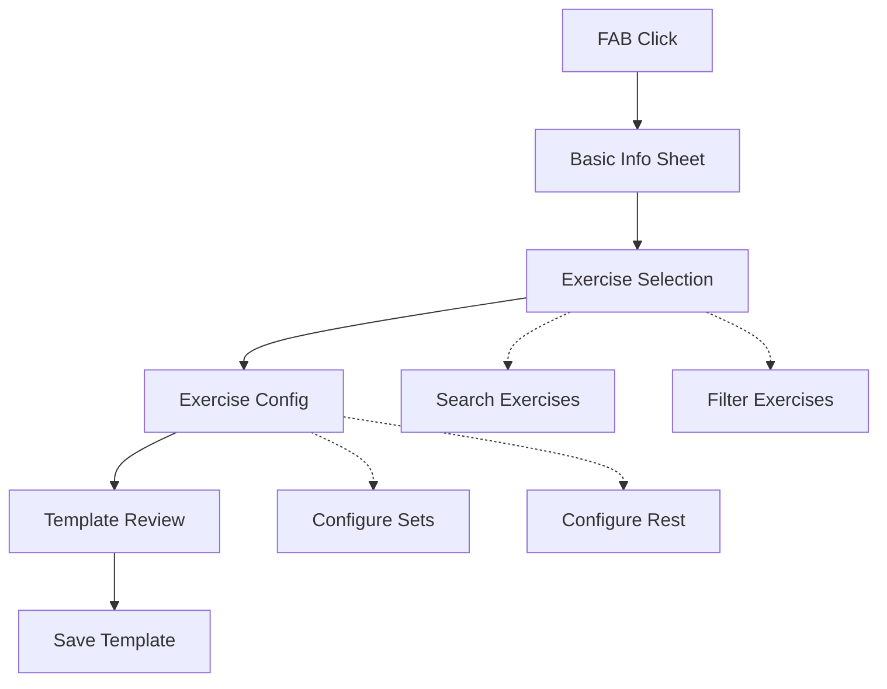

# Template Organization and Creation

**Last Updated:** 2025-04-02  
**Status:** Active  
**Related To:** Library Management, Workout Templates, User Experience

## Overview

This document outlines both the organization system for workout templates and the template creation process in the POWR app. It covers the folder-based organization system with drag-and-drop capabilities and the guided template creation flow.

## Template Organization

### Problem Statement

Users need a flexible way to organize their growing collection of workout templates. As users accumulate templates from various sources (local creation, POWR packs, Nostr), a more robust organization system is required beyond the current flat list with basic filtering.

### Current Implementation Status


| Feature | Status | Description |
|---------|--------|-------------|
| Folder Structure | 🟡 | Basic implementation in progress |
| Drag-and-Drop | 🟡 | Core functionality in testing |
| Template Search | ✅ | Cross-folder searching implemented |
| Template Filtering | ✅ | Category and favorite filters working |
| Custom Sorting | 🟡 | Manual ordering partially implemented |

### Folder Organization

The template organization system provides users with the following capabilities:

- Create, rename, and delete folders
- Move templates between folders via drag-and-drop
- Reorder templates within folders
- Reorder folders themselves
- Collapse/expand folder views
- Support template color coding
- Batch operations for moving/deleting templates

### Technical Implementation

#### Data Structure

```typescript
interface TemplateFolder {
  id: string;
  name: string;
  color?: string;
  icon?: string;
  order: number;
  created_at: number;
  updated_at: number;
}

interface Template {
  // ... existing fields ...
  folder_id?: string;  // Optional - null means root level
  order: number;      // Position within folder or root
}
```

#### Core Components

```typescript
// Folder management
interface FolderManagerHook {
  folders: TemplateFolder[];
  createFolder: (name: string) => Promise<string>;
  updateFolder: (id: string, data: Partial<TemplateFolder>) => Promise<void>;
  deleteFolder: (id: string) => Promise<void>;
  reorderFolder: (id: string, newOrder: number) => Promise<void>;
}

// Draggable template component
interface DraggableTemplateProps {
  template: Template;
  onDragStart?: () => void;
  onDragEnd?: (dropZone: DropZone) => void;
  isDragging?: boolean;
}

// Drop zone types
type DropZone = {
  type: 'folder' | 'root' | 'template';
  id: string;
  position: 'before' | 'after' | 'inside';
}
```

#### Implementation Strategy

The drag-and-drop functionality is implemented using:
- `react-native-reanimated` for smooth animations
- `react-native-gesture-handler` for cross-platform gestures
- SQLite for local persistence
- Nostr events for cloud synchronization

### Future Enhancements

- Nested folders
- Folder sharing via Nostr
- Template duplication
- Advanced sorting options
- Folder templates (to quickly create multiple templates with similar structure)
- Grid view option

## Template Creation

### Problem Statement

Users need a guided, step-by-step interface to create workout templates. The system should focus on the core strength training features while maintaining an architecture that can be extended to support other workout types.

### Current Implementation Status


| Feature | Status | Description |
|---------|--------|-------------|
| Basic Template Creation | ✅ | Create/edit/delete templates completed |
| Exercise Selection | ✅ | Search and add from exercise library |
| Sets/Reps Configuration | ✅ | Basic configuration implemented |
| Template Preview | ✅ | Preview before saving implemented |
| Template Duplication | ❌ | Not yet implemented |
| Exercise Reordering | ❌ | Not yet implemented |
| Advanced Workout Types | 🟡 | Circuit/EMOM/AMRAP in development |

### Creation Flow

The template creation process follows a multi-step wizard pattern:

1. **Basic Info**: Enter template name, description, and target muscle groups
2. **Exercise Selection**: Search and add exercises from the library
3. **Exercise Configuration**: Configure sets, reps, rest periods for each exercise
4. **Template Review**: Preview the complete template before saving
5. **Save Template**: Store the template to the library



### Technical Implementation

#### Data Structure

The POWR app uses a database schema compatible with Nostr for future sync capabilities:

```typescript
interface StrengthTemplate {
  id: string;
  title: string;
  description?: string;
  type: 'strength';
  targetMuscleGroups: string[];
  exercises: TemplateExercise[];
  created_at: number;
  updated_at: number;
  source: 'local' | 'powr' | 'nostr';
  format?: {
    // Template-wide format settings
    weight?: boolean;
    reps?: boolean;
    rpe?: boolean;
    set_type?: boolean;
  };
  format_units?: {
    weight: 'kg' | 'lbs';
    reps: 'count';
    rpe: '0-10';
    set_type: 'warmup|normal|drop|failure';
  };
}

interface TemplateExercise {
  exerciseId: string;
  orderIndex: number;
  sets: number;
  reps: number;
  weight?: number;
  rpe?: number;
  setType: 'warmup' | 'normal' | 'drop' | 'failure';
  restSeconds?: number;
  notes?: string;
  // Format overrides omitted for brevity
}
```

#### Core Components

The template creation process consists of several key components:

1. **Template Creation Sheet**: Main container for the creation flow
2. **Basic Info Form**: Input fields for template metadata
3. **Exercise Selection Component**: Searchable list with quick-add
4. **Exercise Configuration Form**: Input for sets, reps, and other parameters
5. **Template Preview**: Displays the template with editing capabilities

#### UI/UX Considerations

- Loading states with skeleton loaders for exercise list
- Disabled buttons during operations
- Progress indicators for database operations
- Validation error messages
- Required field notifications
- Save confirmations and success states

### Future Enhancements

- Circuit workout support
- EMOM workout support
- AMRAP workout support
- Complex progression schemes
- Template variations
- AI-assisted template creation
- Exercise substitutions
- Previous workout data import

## Integration Points

The template organization and creation systems integrate with several other components:

- **Library Management**: Templates appear in the library view
- **Workout Execution**: Templates are used to start workouts
- **POWR Packs**: Imported templates are integrated into the organization system
- **Nostr Sharing**: Templates can be shared and synchronized via Nostr
- **Exercise Library**: Provides exercises for template creation

## Related Documentation

- [Library Overview](./library_overview.md) - General library functionality
- [POWR Packs](../powr_packs/overview.md) - Template pack importing
- [Workout Execution](../workout/workout_overview.md) - Using templates in workouts
