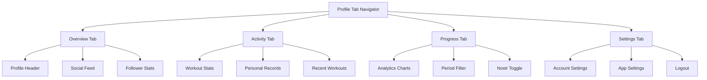

# Profile Section Documentation

**Last Updated:** 2025-04-02  
**Status:** Implemented  
**Related To:** [Nostr Integration](../../technical/nostr/index.md), [Analytics](../../technical/analytics/index.md)

## Overview

The Profile section provides users with a comprehensive interface for managing their personal information, viewing activity, tracking progress, and configuring application settings. This documentation covers all aspects of the Profile tab implementation, from high-level architecture to specific implementation details.

## Documentation Structure

### Core Documentation

- [Profile Tab Overview](./profile_overview.md) - High-level overview of the Profile tab structure and architecture
- [Authentication Patterns](./authentication_patterns.md) - Technical details on authentication implementation and React hook ordering

### Tab Implementation Details

- [Profile (Overview) Tab](./tabs/overview_tab.md) - User profile display and social feed
- [Activity Tab](./tabs/activity_tab.md) - User activity summary and recent workouts
- [Progress Tab](./tabs/progress_tab.md) - Workout analytics and progress tracking
- [Settings Tab](./tabs/settings_tab.md) - Application and account settings

### Technical Features

- [Progress Tracking](./progress_tracking.md) - Implementation details for workout progress tracking
- [Follower Statistics](./follower_stats.md) - NostrBand integration for follower statistics

## Key Technical Concepts

The Profile section implements several key technical concepts that are worth highlighting:

### Authentication Pattern

The Profile tab implements a consistent authentication pattern that ensures React hook ordering is maintained while supporting conditional rendering based on authentication state. See [Authentication Patterns](./authentication_patterns.md) for details.

### Components and Data Flow



### Hook Management

The Profile section carefully manages React hooks to ensure they are called consistently regardless of conditional rendering:

```javascript
// Always define hooks at the top level, regardless of authentication state
const { isAuthenticated } = useNDKCurrentUser();
const someHook = useSomeHook();

// Only after all hooks are defined, use conditional rendering
if (!isAuthenticated) {
  return <LoginComponent />;
}

// Continue with authenticated UI
```

### Nostr Integration

The Profile section deeply integrates with Nostr for user profiles, follower statistics, and social feed:

```javascript
// Example of Nostr integration in the profile
const { currentUser, isAuthenticated } = useNDKCurrentUser();
const { followersCount, followingCount } = useProfileStats({ 
  pubkey: currentUser?.pubkey || ''
});
```

## Implementation Challenges

Several key implementation challenges were addressed in the Profile section:

1. **React Hook Consistency**: Ensuring React hooks are called in the same order regardless of authentication state
2. **Feed Data Transformation**: Transforming feed data from different sources into a consistent format
3. **Analytics Visualization**: Creating user-friendly visualizations of workout analytics
4. **Offline Support**: Graceful handling of offline state throughout the Profile section

## Related Documentation

- [Nostr Integration](../../technical/nostr/index.md) - General Nostr integration documentation
- [Analytics Implementation](../../technical/analytics/index.md) - Implementation details for analytics
- [Theme System](../../technical/styling/theme_system.md) - App theming system
