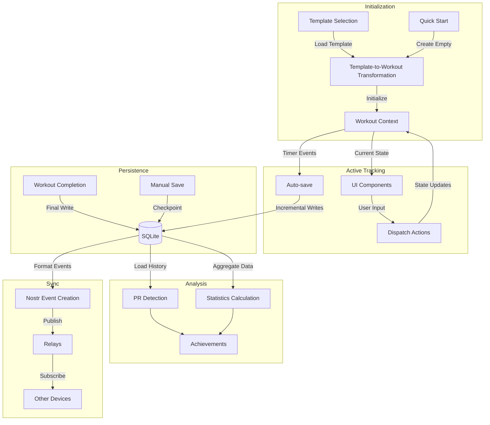

# Workout Data Models

**Last Updated:** 2025-03-26  
**Status:** Active  
**Related To:** Workout Features, Data Layer

## Purpose

This document details the data structures, persistence strategies, and transformation logic for the workout feature. It covers the entire data lifecycle from workout creation through completion, storage, and analysis.

## Data Flow Overview



## Core Data Structures

### Workout State

```typescript
interface WorkoutState {
  status: 'idle' | 'active' | 'paused' | 'completed';
  activeWorkout: Workout | null;
  currentExerciseIndex: number;
  currentSetIndex: number;
  startTime: number | null;
  endTime: number | null;
  elapsedTime: number;
  restTimer: {
    isActive: boolean;
    duration: number;
    remaining: number;
    exerciseId?: string;
    setIndex?: number;
  };
  needsSave: boolean;
  lastSaved: number | null;
}
```

### Workout Model

```typescript
interface Workout {
  id: string;
  title: string;
  type: WorkoutType;
  startTime: number;
  endTime?: number;
  isCompleted: boolean;
  templateId?: string;
  exercises: WorkoutExercise[];
  notes?: string;
  tags: string[];
  lastUpdated: number;
}

type WorkoutType = 'strength' | 'circuit' | 'emom' | 'amrap';

interface WorkoutExercise {
  id: string;
  sourceId: string; // Reference to exercise definition
  title: string;
  sets: WorkoutSet[];
  notes?: string;
  isDirty: boolean;
  isCompleted: boolean;
  order: number;
  restTime?: number;
}

interface WorkoutSet {
  id: string;
  setNumber: number;
  type: SetType;
  weight?: number;
  reps?: number;
  rpe?: number;
  isCompleted: boolean;
  isDirty: boolean;
  timestamp?: number;
  notes?: string;
}

type SetType = 'normal' | 'warmup' | 'dropset' | 'failure' | 'amrap';
```

### Workout Summary

```typescript
interface WorkoutSummary {
  id: string;
  title: string;
  type: WorkoutType;
  duration: number; // In milliseconds
  startTime: number;
  endTime: number;
  exerciseCount: number;
  completedExercises: number;
  totalVolume: number;
  totalReps: number;
  averageRpe?: number;
  exerciseSummaries: ExerciseSummary[];
  personalRecords: PersonalRecord[];
}

interface ExerciseSummary {
  exerciseId: string;
  title: string;
  setCount: number;
  completedSets: number;
  volume: number;
  peakWeight?: number;
  totalReps: number;
  averageRpe?: number;
}
```

### Personal Records

```typescript
interface PersonalRecord {
  id: string;
  exerciseId: string;
  metric: 'weight' | 'reps' | 'volume';
  value: number;
  workoutId: string;
  achievedAt: number;
}
```

## Data Transformation

### Template to Workout Conversion

```typescript
interface WorkoutTemplateToWorkoutParams {
  template: Template;
  workoutSettings?: {
    skipExercises?: string[];
    addExercises?: WorkoutExercise[];
    adjustRestTimes?: boolean;
    scaleWeights?: number; // Percentage multiplier
  };
}

function convertTemplateToWorkout(
  params: WorkoutTemplateToWorkoutParams
): Workout {
  const { template, workoutSettings = {} } = params;
  
  // Create base workout
  const workout: Workout = {
    id: generateUuid(),
    title: template.title,
    type: template.type,
    startTime: Date.now(),
    isCompleted: false,
    templateId: template.id,
    exercises: [],
    tags: [...template.tags],
    lastUpdated: Date.now()
  };
  
  // Process exercises
  const exercisesToInclude = template.exercises
    .filter(e => !workoutSettings.skipExercises?.includes(e.id));
  
  workout.exercises = exercisesToInclude.map((templateExercise, index) => {
    // Transform each exercise
    const workoutExercise: WorkoutExercise = {
      id: generateUuid(),
      sourceId: templateExercise.id,
      title: templateExercise.title,
      sets: templateExercise.sets.map((templateSet, setIndex) => ({
        id: generateUuid(),
        setNumber: setIndex + 1,
        type: templateSet.type,
        weight: templateSet.weight * (workoutSettings.scaleWeights || 1),
        reps: templateSet.reps,
        isCompleted: false,
        isDirty: false
      })),
      isCompleted: false,
      isDirty: false,
      order: index,
      restTime: workoutSettings.adjustRestTimes 
        ? adjustRestTime(templateExercise.restTime)
        : templateExercise.restTime
    };
    
    return workoutExercise;
  });
  
  // Add any additional exercises
  if (workoutSettings.addExercises) {
    workout.exercises = [
      ...workout.exercises,
      ...workoutSettings.addExercises.map((e, i) => ({
        ...e,
        order: workout.exercises.length + i
      }))
    ];
  }
  
  return workout;
}
```

## Database Schema

```sql
-- Active workout tracking
CREATE TABLE IF NOT EXISTS workouts (
  id TEXT PRIMARY KEY,
  title TEXT NOT NULL,
  type TEXT NOT NULL,
  start_time INTEGER NOT NULL,
  end_time INTEGER,
  completed BOOLEAN DEFAULT 0,
  notes TEXT,
  total_volume REAL,
  template_id TEXT,
  nostr_event_id TEXT,
  FOREIGN KEY(template_id) REFERENCES templates(id)
);

-- Individual workout exercises
CREATE TABLE IF NOT EXISTS workout_exercises (
  id TEXT PRIMARY KEY,
  workout_id TEXT NOT NULL,
  exercise_id TEXT NOT NULL,
  position INTEGER NOT NULL,
  notes TEXT,
  FOREIGN KEY(workout_id) REFERENCES workouts(id) ON DELETE CASCADE,
  FOREIGN KEY(exercise_id) REFERENCES exercises(id)
);

-- Set data
CREATE TABLE IF NOT EXISTS workout_sets (
  id TEXT PRIMARY KEY,
  workout_exercise_id TEXT NOT NULL,
  set_number INTEGER NOT NULL,
  weight REAL,
  reps INTEGER,
  rpe REAL,
  completed BOOLEAN DEFAULT 0,
  set_type TEXT NOT NULL,
  timestamp INTEGER,
  FOREIGN KEY(workout_exercise_id) REFERENCES workout_exercises(id) ON DELETE CASCADE
);

-- Personal records
CREATE TABLE IF NOT EXISTS personal_records (
  id TEXT PRIMARY KEY,
  exercise_id TEXT NOT NULL,
  metric TEXT NOT NULL,
  value REAL NOT NULL,
  workout_id TEXT NOT NULL,
  achieved_at INTEGER NOT NULL,
  FOREIGN KEY(exercise_id) REFERENCES exercises(id) ON DELETE CASCADE,
  FOREIGN KEY(workout_id) REFERENCES workouts(id)
);

-- Workout tags
CREATE TABLE IF NOT EXISTS workout_tags (
  workout_id TEXT NOT NULL,
  tag TEXT NOT NULL,
  FOREIGN KEY(workout_id) REFERENCES workouts(id) ON DELETE CASCADE,
  PRIMARY KEY(workout_id, tag)
);

-- Workout statistics
CREATE TABLE IF NOT EXISTS workout_statistics (
  workout_id TEXT PRIMARY KEY,
  stats_json TEXT NOT NULL, -- Flexible JSON storage for various metrics
  calculated_at INTEGER NOT NULL,
  FOREIGN KEY(workout_id) REFERENCES workouts(id) ON DELETE CASCADE
);
```

## Data Persistence Strategies

### Incremental Saving

```typescript
class WorkoutPersistence {
  // Save entire workout
  async saveWorkout(workout: Workout): Promise<void> {
    return this.db.withTransactionAsync(async () => {
      // 1. Save workout metadata
      await this.db.runAsync(
        `INSERT OR REPLACE INTO workouts 
         (id, title, type, start_time, end_time, completed, notes, template_id) 
         VALUES (?, ?, ?, ?, ?, ?, ?, ?)`,
        [
          workout.id, 
          workout.title, 
          workout.type, 
          workout.startTime,
          workout.endTime || null,
          workout.isCompleted ? 1 : 0,
          workout.notes || null,
          workout.templateId || null
        ]
      );
      
      // 2. Save exercises
      for (const exercise of workout.exercises) {
        await this.db.runAsync(
          `INSERT OR REPLACE INTO workout_exercises
           (id, workout_id, exercise_id, position, notes)
           VALUES (?, ?, ?, ?, ?)`,
          [
            exercise.id,
            workout.id,
            exercise.sourceId,
            exercise.order,
            exercise.notes || null
          ]
        );
        
        // 3. Save sets
        for (const set of exercise.sets) {
          await this.db.runAsync(
            `INSERT OR REPLACE INTO workout_sets
             (id, workout_exercise_id, set_number, weight, reps, rpe, completed, set_type, timestamp)
             VALUES (?, ?, ?, ?, ?, ?, ?, ?, ?)`,
            [
              set.id,
              exercise.id,
              set.setNumber,
              set.weight || null,
              set.reps || null,
              set.rpe || null,
              set.isCompleted ? 1 : 0,
              set.type,
              set.timestamp || null
            ]
          );
        }
      }
    });
  }
  
  // Save only modified data
  async saveIncrementalChanges(workout: Workout): Promise<void> {
    const dirtyExercises = workout.exercises.filter(e => e.isDirty);
    
    return this.db.withTransactionAsync(async () => {
      // Update workout metadata
      await this.db.runAsync(
        `UPDATE workouts SET
         title = ?, type = ?, end_time = ?, completed = ?, notes = ?
         WHERE id = ?`,
        [
          workout.title,
          workout.type,
          workout.endTime || null,
          workout.isCompleted ? 1 : 0,
          workout.notes || null,
          workout.id
        ]
      );
      
      // Only update changed exercises and sets
      for (const exercise of dirtyExercises) {
        await this.db.runAsync(
          `UPDATE workout_exercises SET
           position = ?, notes = ?
           WHERE id = ?`,
          [
            exercise.order,
            exercise.notes || null,
            exercise.id
          ]
        );
        
        // Update dirty sets
        const dirtySets = exercise.sets.filter(s => s.isDirty);
        for (const set of dirtySets) {
          await this.db.runAsync(
            `UPDATE workout_sets SET
             weight = ?, reps = ?, rpe = ?, completed = ?, timestamp = ?
             WHERE id = ?`,
            [
              set.weight || null,
              set.reps || null,
              set.rpe || null,
              set.isCompleted ? 1 : 0,
              set.timestamp || null,
              set.id
            ]
          );
          set.isDirty = false;
        }
        
        exercise.isDirty = false;
      }
    });
  }
}
```

### Auto-save Implementation

```typescript
function useAutoSave(
  workout: Workout | null,
  needsSave: boolean,
  saveWorkout: (workout: Workout) => Promise<void>
) {
  const [lastSaveTime, setLastSaveTime] = useState<number | null>(null);
  const saveIntervalRef = useRef<NodeJS.Timeout | null>(null);
  
  useEffect(() => {
    if (!workout) return;
    
    // Set up interval for periodic saves
    saveIntervalRef.current = setInterval(() => {
      if (workout && needsSave) {
        saveWorkout(workout)
          .then(() => setLastSaveTime(Date.now()))
          .catch(err => console.error('Auto-save failed:', err));
      }
    }, 30000); // 30 seconds
    
    return () => {
      if (saveIntervalRef.current) {
        clearInterval(saveIntervalRef.current);
      }
    };
  }, [workout, needsSave, saveWorkout]);
  
  // Additional save on app state changes
  useAppState(
    (nextAppState) => {
      if (nextAppState === 'background' && workout && needsSave) {
        saveWorkout(workout)
          .then(() => setLastSaveTime(Date.now()))
          .catch(err => console.error('Background save failed:', err));
      }
    }
  );
  
  return lastSaveTime;
}
```

## Nostr Integration

### Nostr Event Creation

```typescript
function createNostrWorkoutEvent(workout: CompletedWorkout): NostrEvent {
  return {
    kind: 33403, // Workout Record
    content: workout.notes || '',
    tags: [
      ['d', workout.id],
      ['title', workout.title],
      ['type', workout.type],
      ['start', workout.startTime.toString()],
      ['end', workout.endTime.toString()],
      ['completed', workout.isCompleted.toString()],
      
      // Exercise data
      ...workout.exercises.flatMap(exercise => {
        const exerciseRef = `33401:${exercise.author || 'local'}:${exercise.sourceId}`;
        
        return exercise.sets.map(set => [
          'exercise',
          exerciseRef,
          set.weight?.toString() || '',
          set.reps?.toString() || '',
          set.rpe?.toString() || '',
          set.type,
        ]);
      }),
      
      // PR tags if applicable
      ...workout.personalRecords.map(pr => [
        'pr',
        `${pr.exerciseId},${pr.metric},${pr.value}`
      ]),
      
      // Categorization tags
      ...workout.tags.map(tag => ['t', tag])
    ],
    created_at: Math.floor(workout.endTime / 1000),
  };
}
```

## Error Handling and Recovery

```typescript
async function checkForUnfinishedWorkouts(): Promise<Workout | null> {
  try {
    const activeWorkouts = await db.getAllAsync<ActiveWorkoutRow>(
      'SELECT * FROM workouts WHERE end_time IS NULL AND completed = 0'
    );
    
    if (activeWorkouts.length === 0) return null;
    
    // Find most recent active workout
    const mostRecent = activeWorkouts.reduce((latest, current) => 
      current.last_updated > latest.last_updated ? current : latest
    );
    
    // Reconstruct full workout object
    return reconstructWorkoutFromDatabase(mostRecent.id);
  } catch (error) {
    console.error('Error checking for unfinished workouts:', error);
    return null;
  }
}

async function reconstructWorkoutFromDatabase(workoutId: string): Promise<Workout | null> {
  try {
    // Fetch workout
    const workoutRow = await db.getFirstAsync<WorkoutRow>(
      'SELECT * FROM workouts WHERE id = ?',
      [workoutId]
    );
    
    if (!workoutRow) return null;
    
    // Fetch exercises
    const exerciseRows = await db.getAllAsync<WorkoutExerciseRow>(
      'SELECT * FROM workout_exercises WHERE workout_id = ? ORDER BY position',
      [workoutId]
    );
    
    // Construct workout object
    const workout: Workout = {
      id: workoutRow.id,
      title: workoutRow.title,
      type: workoutRow.type as WorkoutType,
      startTime: workoutRow.start_time,
      endTime: workoutRow.end_time || undefined,
      isCompleted: Boolean(workoutRow.completed),
      templateId: workoutRow.template_id || undefined,
      notes: workoutRow.notes || undefined,
      exercises: [],
      tags: [],
      lastUpdated: workoutRow.last_updated || Date.now()
    };
    
    // Fetch tags
    const tagRows = await db.getAllAsync<{ tag: string }>(
      'SELECT tag FROM workout_tags WHERE workout_id = ?',
      [workoutId]
    );
    
    workout.tags = tagRows.map(row => row.tag);
    
    // Populate exercises with sets
    for (const exerciseRow of exerciseRows) {
      // Fetch sets
      const setRows = await db.getAllAsync<WorkoutSetRow>(
        'SELECT * FROM workout_sets WHERE workout_exercise_id = ? ORDER BY set_number',
        [exerciseRow.id]
      );
      
      const exercise: WorkoutExercise = {
        id: exerciseRow.id,
        sourceId: exerciseRow.exercise_id,
        title: exerciseRow.title || '', // Fetch from exercise if needed
        sets: setRows.map(setRow => ({
          id: setRow.id,
          setNumber: setRow.set_number,
          type: setRow.set_type as SetType,
          weight: setRow.weight || undefined,
          reps: setRow.reps || undefined,
          rpe: setRow.rpe || undefined,
          isCompleted: Boolean(setRow.completed),
          isDirty: false,
          timestamp: setRow.timestamp || undefined,
        })),
        notes: exerciseRow.notes || undefined,
        isDirty: false,
        isCompleted: Boolean(exerciseRow.completed),
        order: exerciseRow.position,
        restTime: exerciseRow.rest_time || undefined
      };
      
      workout.exercises.push(exercise);
    }
    
    return workout;
  } catch (error) {
    console.error('Error reconstructing workout:', error);
    return null;
  }
}
```

## Analytics and Metrics

```typescript
interface WorkoutMetrics {
  // Time metrics
  totalDuration: number;
  exerciseTime: number;
  restTime: number;
  averageSetDuration: number;
  
  // Volume metrics
  totalVolume: number;
  volumeByExercise: Record<string, number>;
  volumeByMuscleGroup: Record<string, number>;
  
  // Intensity metrics
  averageRpe: number;
  peakRpe: number;
  intensityDistribution: {
    low: number;    // Sets with RPE 1-4
    medium: number; // Sets with RPE 5-7
    high: number;   // Sets with RPE 8-10
  };
  
  // Completion metrics
  exerciseCompletionRate: number;
  setCompletionRate: number;
  plannedVsActualVolume: number;
}
```

## Implementation Status

### Completed

- Core data model definitions
- SQLite schema implementation
- Basic persistence layer
- Template-to-workout conversion
- Workout state management

### In Progress

- Nostr event integration
- PR detection and achievements
- Enhanced recovery mechanisms
- Analytics metrics calculation

### Planned

- Synchronization with other devices
- Historical trend analysis
- Machine learning integration for performance insights
- Enhanced backup mechanisms

## Related Documentation

- [Workout Overview](./workout_overview.md) - General workout feature architecture
- [UI Components](./ui_components.md) - UI components using these data models
- [Completion Flow](./completion_flow.md) - Workout completion and saving
- [Implementation Roadmap](./implementation_roadmap.md) - Development timeline
- [Nostr Exercise NIP](../../technical/nostr/exercise_nip.md) - Nostr protocol specification
