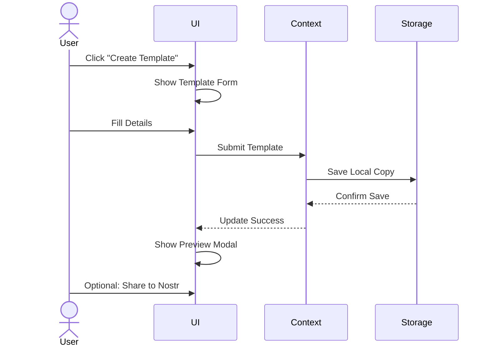
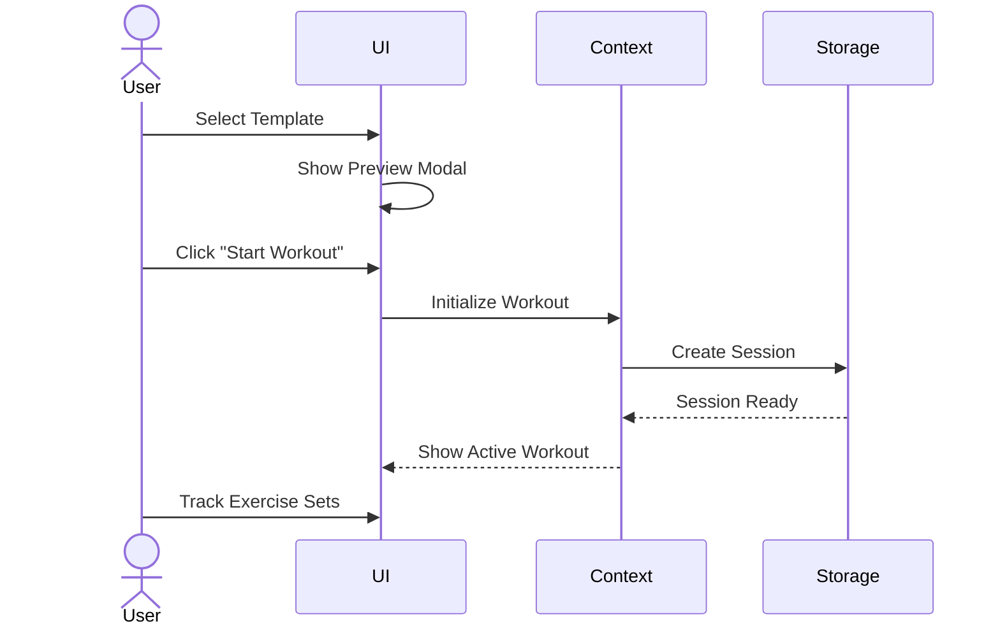
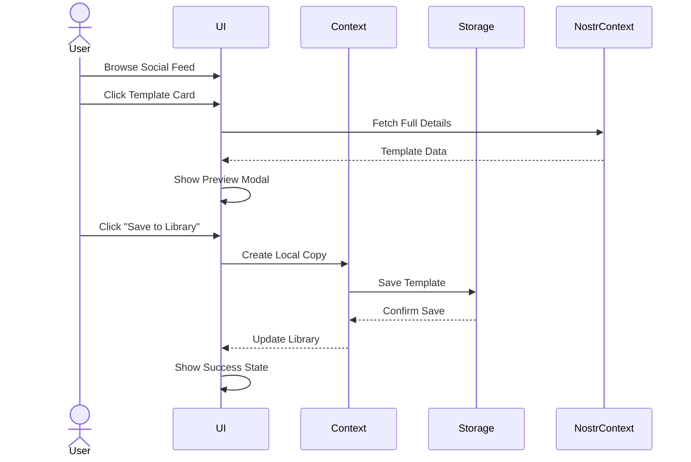
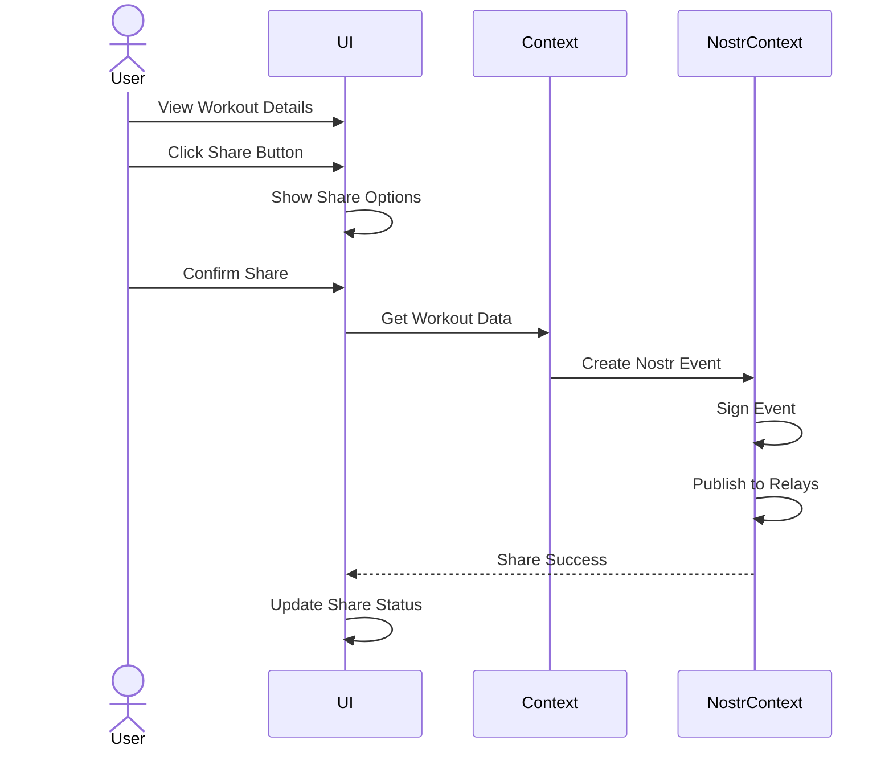

# POWR Controlled Restart Plan

## Overview

POWR is transitioning from a traditional fitness tracking application to a decentralized platform utilizing the Nostr protocol. This document outlines the plan for a controlled restart that prioritizes local-first functionality while preparing for Nostr integration.

## Current State Assessment

### Core Functionality
- Workout tracking and management
- Exercise and template library
- Local data storage
- Early Nostr integration attempts

### Key Challenges
1. Data Structure Misalignment
   - Complex type hierarchies
   - Overlapping interfaces
   - Future Nostr integration difficulties

2. State Management
   - Growing complexity in WorkoutContext
   - Mixed concerns between local and network
   - Auto-save and persistence challenges

3. User Experience
   - Unclear content ownership
   - Complex template management
   - Limited sharing capabilities

## Restart Goals

### Primary Objectives
1. Local-First Architecture
   - All core features work offline
   - Clean data structures
   - Clear state management

2. User Experience
   - Maintain familiar workout tracking
   - Improve template management
   - Clear content ownership

3. Nostr Readiness
   - Aligned data structures
   - Clear sharing model
   - Metadata management

## Architecture Decisions

### Content Organization
```plaintext
Library/
├── Exercises/
│   ├── My Exercises
│   ├── Saved Exercises
│   └── Exercise History
│
├── Workouts/
│   ├── My Templates
│   ├── Saved Templates
│   └── Workout History
│
└── Programs/ (Coming Soon)
    ├── Active Programs
    ├── Saved Programs
    └── Program History
```

### User Interface Patterns
1. Content Cards
   - Quick preview information
   - Source indicators (Local/Nostr)
   - Action buttons

2. Preview Modal
   - Detailed content view
   - Primary actions (Start/Add/Edit)
   - Access to technical details

3. Technical Panel
   - Nostr metadata
   - Event IDs
   - Relay information

### Data Flow
```plaintext
Local Storage (Primary)
   ↓
User Actions
   ↓
Optional Nostr Sync
```

## Component Architecture

### Component Usage Map

```plaintext
Navigation/
├── Home Tab
│   ├── Quick Start Section
│   │   └── ContentCard (Recent/Favorite Workouts)
│   └── Current Progress
│
├── Library Tab
│   ├── Exercises Section
│   │   ├── ContentCard (Exercise Templates)
│   │   ├── PreviewModal (Exercise Details)
│   │   └── TechnicalPanel (if Nostr-sourced)
│   │
│   ├── Workouts Section
│   │   ├── ContentCard (Workout Templates)
│   │   ├── PreviewModal (Workout Details)
│   │   └── TechnicalPanel (if Nostr-sourced)
│   │
│   └── Programs Section (Coming Soon)
│       └── ContentCard (Placeholder)
│
├── Social Tab
│   ├── Discovery Feed
│   │   ├── ContentCard (Shared Templates)
│   │   ├── PreviewModal (Template Details)
│   │   └── TechnicalPanel (Nostr Details)
│   └── User Profiles
│
└── History Tab
    └── ContentCard (Past Workouts)

Active Workout Screen
├── Exercise List
└── ContentCard (Current Exercise)
```

### Core Components
1. Content Display
   ```plaintext
   ContentCard/
   ├── Preview Image/Icon
   ├── Basic Info
   │   ├── Title
   │   ├── Description
   │   └── Source Indicator
   ├── Quick Actions
   └── Click Handler → Preview Modal

   PreviewModal/
   ├── Content Details
   │   ├── Full Description
   │   ├── Exercise List/Details
   │   └── Usage Stats
   ├── Action Buttons
   │   ├── Primary (Start/Add)
   │   ├── Secondary (Edit/Share)
   │   └── Info Button
   └── Technical Panel (expandable)

   TechnicalPanel/
   ├── Event Information
   ├── Relay Details
   └── Sharing Status
   ```

2. Form Components
   ```plaintext
   ExerciseForm/
   ├── Basic Info
   ├── Set Configuration
   └── Equipment Selection

   WorkoutForm/
   ├── Basic Info
   ├── Exercise Selection
   └── Template Options
   ```

3. Workout Interface
   ```plaintext
   ActiveWorkout/
   ├── Exercise List
   ├── Set Tracking
   ├── Rest Timer
   └── Progress Indicators
   ```

### User Flows

1. Template Creation


### User Flows

1. Creating Template


2. Starting Workout from Template


3. Saving Discovered Template


4. Sharing Workout


## Existing Solutions Integration

### NDK Mobile Resources
1. Core Components
   - SQLite Cache Adapter for template/workout storage
   - Session Management for user profiles and signing
   - Event Subscription system for content discovery
   - Built-in relay management

2. Implementation Benefits
   - Pre-built SQLite schema and migrations
   - Automatic event caching and deduplication
   - Profile management system
   - Connection handling

### Olas Patterns
1. State Management
   - Session store patterns
   - Event caching approach
   - Profile management

2. UI Components
   - Event card patterns
   - Preview/detail views
   - Action handling

3. Event Handling Patterns
   - Content discovery
   - Template sharing
   - Social interactions

## Development Phases and Components

### Phase 1: Core Components Review

#### Components to Reuse
1. Active Workout Interface
   - Exercise tracking ✓
   - Set logging ✓
   - Rest timer ✓
   - Basic stats ✓

2. Form Components
   - Exercise form ✓
   - Basic input fields ✓
   - Validation logic ✓

3. Navigation
   - Tab structure ✓
   - Basic routing ✓

#### Components to Rebuild
1. Content Display
   - ContentCard (new design)
   - PreviewModal (enhanced)
   - TechnicalPanel (new)

2. Library Management
   - Template organization
   - Content filtering
   - Search interface

3. Social Integration
   - Discovery feed
   - Share interface
   - Profile views

### Phase 2: Feature Implementation

#### Week 1-2: Core UI
- [ ] Build ContentCard component
- [ ] Implement PreviewModal
- [ ] Create TechnicalPanel
- [ ] Update navigation flow

#### Week 3-4: Library System
- [ ] Implement new library structure
- [ ] Build template management
- [ ] Add search/filter capabilities
- [ ] Create exercise library

#### Week 5-6: Local Features
- [ ] Complete workout tracking
- [ ] Add template system
- [ ] Implement history
- [ ] Add basic stats

#### Week 7-8: Nostr Integration
- [ ] Add sharing capabilities
- [ ] Implement discovery
- [ ] Build social features
- [ ] Add technical details view


## Implementation Strategy

### Phase 1: Core Infrastructure
1. Data Structures
   - Define base types
   - Implement storage models
   - Create type validators

2. State Management
   - Implement WorkoutContext
   - Setup storage service
   - Add auto-save logic

3. UI Components
   - Build reusable components
   - Implement content cards
   - Create preview modals

### Phase 2: Template System
1. Exercise Management
   - Exercise creation
   - Template storage
   - History tracking

2. Workout Templates
   - Template creation
   - Usage tracking
   - Version management

### Phase 3: Nostr Integration
1. Basic Integration
   - Event structure alignment
   - Local/Nostr bridging
   - Sharing mechanics

2. Social Features
   - Content discovery
   - Template sharing
   - User interactions