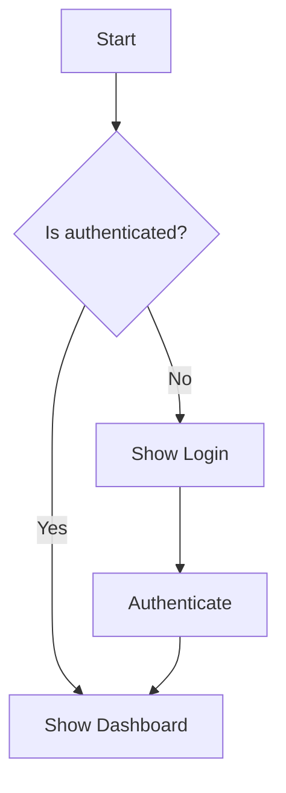

# Documentation Standards

**Last Updated:** 2025-03-26  
**Status:** Active  
**Related To:** Documentation Organization, Content Guidelines

## Purpose

This document defines the standards for documentation in the POWR app repository. It provides guidelines for formatting, structure, content quality, and maintenance to ensure consistency and clarity across all documentation.

## Document Structure

### File Organization

- All documentation should be organized according to the structure defined in [organization_plan.md](./organization_plan.md)
- Use `snake_case` for all filenames (e.g., `state_management.md` not `StateManagement.md`)
- Group related documents in appropriate directories
- Use meaningful directory and file names that clearly indicate content

### Document Header

Every document should begin with a consistent header:

```markdown
# Document Title

**Last Updated:** YYYY-MM-DD  
**Status:** [Active|Draft|Archived]  
**Related To:** [Feature/Component]

## Purpose

Brief description of this document's purpose and what it covers.
```

### Status Types

- **Active**: Current documentation that accurately reflects the codebase
- **Draft**: Work in progress, not yet complete or verified
- **Archived**: Kept for historical reference but no longer reflects current state
- **Superseded**: Replaced by newer document (include link to replacement)

## Content Guidelines

### General Principles

1. **Clear and Concise**: Use simple, direct language
2. **Accurate**: Must reflect current implementation
3. **Complete**: Cover all necessary aspects of the topic
4. **Structured**: Use logical organization with clear sections
5. **Audience-Aware**: Consider who will read the document (developers, designers, etc.)

### Writing Style

- Use present tense ("The function returns..." not "The function will return...")
- Use active voice when possible ("The system stores data..." not "Data is stored by the system...")
- Be direct and concise
- Define acronyms and technical terms on first use
- Use consistent terminology throughout

### Headings and Sections

- Use clear, descriptive headings
- Follow heading hierarchy (# → ## → ### → ####)
- Don't skip levels (e.g., don't go from ## to ####)
- Keep heading structure logical and consistent

### Code Examples

- Include relevant code examples where helpful
- Use syntax highlighting with appropriate language tags

```typescript
// Good example with syntax highlighting
function calculateTotal(items: Item[]): number {
  return items.reduce((sum, item) => sum + item.price, 0);
}
```

- Ensure examples are accurate and follow coding standards
- Include comments in code examples when needed for clarity
- Keep examples concise and focused on the topic

### Lists and Tables

- Use bulleted lists for unordered items
- Use numbered lists for sequential steps or prioritized items
- Use tables for comparing multiple items across consistent criteria
- Include headers for tables

### Diagrams and Visual Aids

- Include diagrams for complex systems or workflows
- Use consistent styles and colors in diagrams
- Provide text descriptions of diagrams for accessibility
- Reference diagrams in the text
- Use standard formats: Mermaid for code-based diagrams, PNG/SVG for images

Example of a Mermaid diagram:



## Cross-Referencing

### Internal References

- Use relative links to reference other documentation
- Include descriptive link text, not just URLs or "here"
- Use section anchors for deep linking when appropriate

Examples:
```markdown
See [Authentication Architecture](../architecture/authentication.md) for details.

For more information about the login flow, see the [Authentication Process](../architecture/authentication.md#authentication-process).
```

### External References

- Provide full URLs for external references
- Include access dates for content that might change
- Consider archiving critical external content that might disappear

## Maintenance

### Update Process

- Update the "Last Updated" date whenever changing a document
- Review documentation whenever related code changes
- Follow the [Documentation Review Process](./review_process.md) for regular reviews
- Archive outdated documents rather than deleting them

### Versioning

- Maintain documentation in sync with code versions
- Clearly indicate which version(s) of code a document applies to
- Create version-specific documentation when necessary for major releases

## Documentation Types

Different types of documentation have specific requirements:

### Architecture Documentation

- Include high-level architectural diagrams
- Describe system components and their interactions
- Explain key design decisions and trade-offs
- Reference relevant design patterns

### API Documentation

- Describe all public APIs/interfaces
- Include parameter types, return values, and exceptions
- Provide usage examples
- Document error handling

### Feature Documentation

- Explain the purpose and use cases
- Describe user interactions and workflows
- Include implementation details important for maintenance
- Provide examples of feature usage

### Tutorial Documentation

- Use step-by-step instructions
- Include clear, annotated examples
- Explain each step thoroughly
- Build from simple to complex

## Accessibility

- Use descriptive link text
- Provide text descriptions for images and diagrams
- Use semantic markup correctly
- Ensure color is not the only way information is conveyed
- Maintain good contrast in diagrams and images

## Related Documentation

- [Documentation Organization Plan](./organization_plan.md) - Overall documentation organization strategy
- [Documentation Review Process](./review_process.md) - Process for reviewing documentation quality
- [Documentation Implementation Script](./implementation_script.md) - Implementation details for migration
- [Documentation Migration Mapping](./migration_mapping.md) - Mapping of source files to destinations
