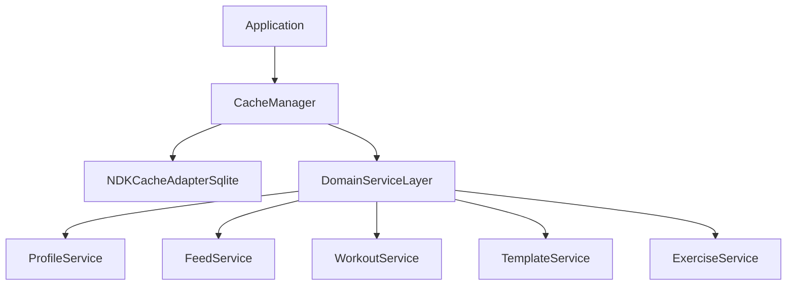

# Cache Management in POWR App

**Last Updated:** 2025-04-01  
**Status:** Active  
**Related To:** Mobile Performance, Offline Support, NDK Integration

## Purpose

This document outlines the caching architecture in the POWR app, including current implementation, future direction, and strategies for optimizing offline functionality, reducing network usage, and enhancing performance.

## Goals

1. **Improve Offline Experience**: Allow users to access critical app features even when offline
2. **Reduce Network Usage**: Minimize data consumption by caching frequently accessed data
3. **Enhance Performance**: Speed up the app by reducing network requests
4. **Maintain Data Freshness**: Implement strategies to keep cached data up-to-date

## Current Implementation

The POWR app currently implements a fragmented caching system with multiple specialized services:

### 1. Profile Image Caching

**Status: Implemented**

The `ProfileImageCache` service downloads and caches profile images locally, providing offline access and reducing network usage.

```typescript
// Key features of ProfileImageCache
- Local storage of profile images in the app's cache directory
- Automatic fetching and caching of images when needed
- Age-based cache invalidation (24 hours by default)
- Integration with UserAvatar component for seamless usage
```

**Integration Points:**
- `UserAvatar` component uses the cache for all profile images
- `EnhancedSocialPost` component uses `UserAvatar` for profile images in the feed
- NDK initialization sets the NDK instance in the ProfileImageCache service

### 2. Publication Queue Service

**Status: Implemented**

The `PublicationQueueService` allows events to be created and queued when offline, then published when connectivity is restored.

```typescript
// Key features of PublicationQueueService
- Persistent storage of unpublished events
- Automatic retry mechanism when connectivity is restored
- Priority-based publishing
- Status tracking for queued events
```

**Integration Points:**
- Social posting
- Workout publishing
- Template sharing

### 3. Social Feed Caching

**Status: Implemented**

The `SocialFeedCache` service caches social feed events locally, allowing users to browse their feed even when offline.

```typescript
// Key features of SocialFeedCache
- SQLite-based storage of feed events
- Feed-specific caching (following, POWR, global)
- Time-based pagination support
- Automatic cleanup of old cached events
```

**Integration Points:**
- `useSocialFeed` hook uses the cache when offline
- `SocialFeedService` manages the cache and provides a unified API
- Feed components display cached content with offline indicators

### 4. Event Cache

**Status: Implemented**

The `EventCache` service provides a lower-level caching mechanism for storing and retrieving Nostr events.

```typescript
// Key features of EventCache
- SQLite-based storage of Nostr events
- Tag-based indexing and retrieval
- Transaction support for batch operations
```

**Integration Points:**
- Used by SocialFeedCache to store individual events
- Referenced by other services needing event data

### 5. Other Domain-Specific Caches

The app also includes several other caching services for specific domains:

- **Workout History Caching**: Stores workout records for offline access
- **Exercise Library Caching**: Maintains a local copy of the exercise database
- **Template Caching**: Provides offline access to workout templates
- **Contact List Caching**: Stores user's contact list for offline use

## Implementation Challenges

Our current implementation has several challenges:

1. **Fragmentation**: Multiple cache services with overlapping functionality
2. **Code Duplication**: Similar patterns reimplemented across services
3. **Inconsistent Strategies**: Different invalidation, error handling, and persistence approaches
4. **Maintenance Burden**: Changes require updates to multiple services
5. **Dependency Management**: Multiple NDK integration points

## NDK Mobile Cache Integration

The NDK Mobile library provides robust built-in caching capabilities through the `NDKCacheAdapterSqlite` class, which we are currently underutilizing. Key features include:

- **Unified SQLite Database Management**: Schema migrations, transaction support
- **Event Caching**: Storage/retrieval of events with tag indexing
- **Profile Caching**: LRU-based profile data caching
- **Unpublished Event Management**: Storing and retrying failed publications
- **Query Interface**: Sophisticated filtering of cached events
- **Write Buffering**: Performance optimizations for database writes

```typescript
// NDK initialization with SQLite cache adapter
const cacheAdapter = new NDKCacheAdapterSqlite('powr', 1000);
await cacheAdapter.initialize();

const ndk = new NDK({
  cacheAdapter,
  explicitRelayUrls: DEFAULT_RELAYS,
  enableOutboxModel: true,
  autoConnectUserRelays: true,
  clientName: 'powr',
});
```

## Future Direction: Centralized Cache Architecture

To address the challenges of our current fragmented approach, we plan to evolve toward a unified caching architecture leveraging NDK Mobile's built-in capabilities.

### Proposed Architecture



### Key Components

1. **CacheManager**: Centralized facade for all caching operations
   - Initializes and configures NDK cache adapter
   - Provides unified API for common operations
   - Manages NDK integration

2. **Domain Services**: Specialized services that focus on business logic
   - Use NDK cache for storage/retrieval
   - Add domain-specific functionality
   - Handle presentation concerns

3. **Media Cache**: For binary data not handled by NDK (images, etc.)
   - File system based storage
   - LRU eviction policies
   - Size limitations and cleanup

### Implementation Roadmap

1. **Phase 1**: Enhance NDK initialization and configuration
   - Configure NDK cache adapter with appropriate settings
   - Create CacheManager facade

2. **Phase 2**: Refactor existing services to use NDK cache
   - Start with ProfileImageCache → ProfileService
   - Update SocialFeedCache to leverage NDK subscription caching

3. **Phase 3**: Add centralized monitoring and management
   - Cache size monitoring
   - Performance metrics
   - Coordinated invalidation

4. **Phase 4**: Implement advanced features
   - Selective syncing
   - Background refreshing
   - Cross-device synchronization

## User Experience Considerations

### Offline Indicators

The app provides clear visual indicators when operating in offline mode:

- Global offline indicator in the header
- Feed-specific offline state components
- Disabled actions that require connectivity
- Queued action indicators

### Transparent Sync

Synchronization happens transparently in the background:

- Automatic publishing of queued events when connectivity is restored
- Progressive loading of fresh content when coming online
- Prioritized sync for critical data

### Data Freshness

The app balances offline availability with data freshness:

- Age indicators for cached content
- Pull-to-refresh to force update when online
- Background refresh of frequently accessed data

## Migration Strategy

Transitioning from our current implementation to the centralized approach will be done incrementally:

1. First, refactor NDK initialization to properly configure the cache adapter
2. Create the CacheManager facade while maintaining compatibility with existing services
3. Gradually update each service to use CacheManager instead of direct database access
4. Consolidate duplicate functionality across services

## Conclusion

The cache management system in POWR is critical for delivering a responsive, offline-capable experience. While our current implementation successfully provides these capabilities, moving toward a more centralized approach based on NDK's built-in features will reduce complexity, improve maintainability, and ensure consistent behavior across the app.

## Related Documentation

- [NDK Comprehensive Guide](../ndk/comprehensive_guide.md) - Overview of NDK functionality
- [Offline Queue](../nostr/offline_queue.md) - Publication queueing for offline support
- [Social Feed Cache Implementation](../../features/social/cache_implementation.md) - Details on feed caching
