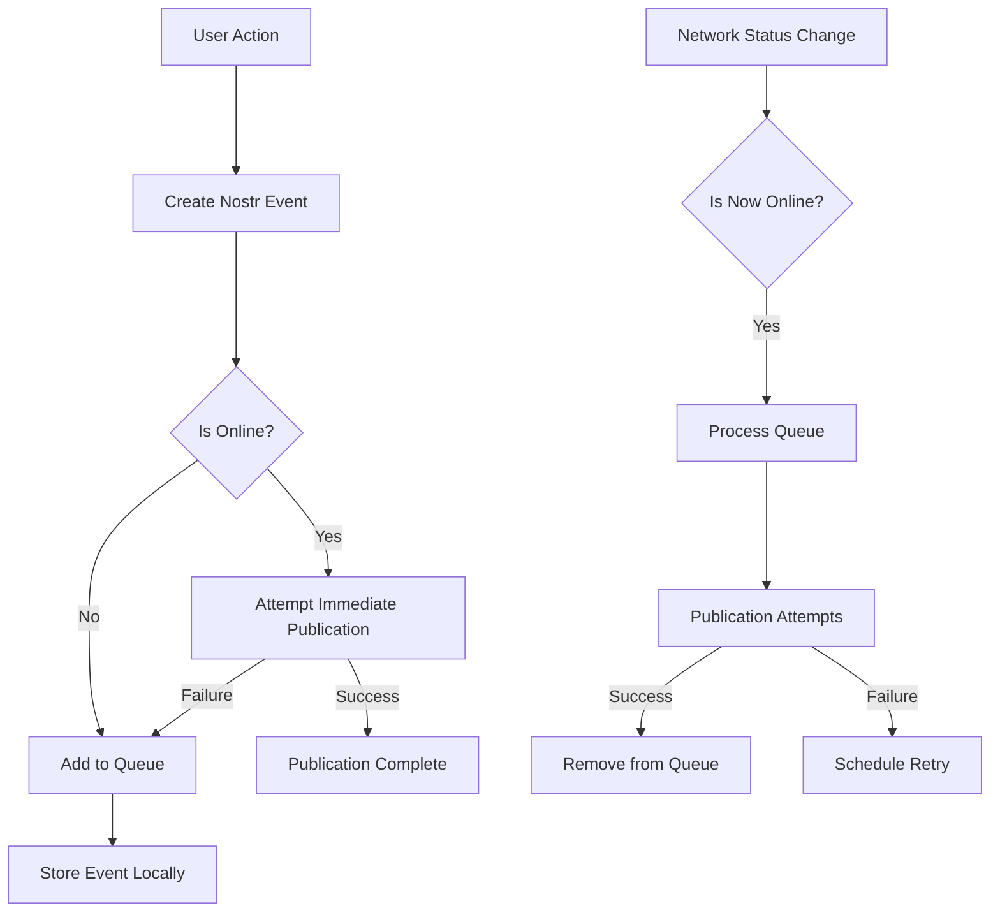

# Nostr Offline Queue

**Last Updated:** 2025-03-26  
**Status:** Active  
**Related To:** Nostr Integration, Offline Support, Publication Queue

## Purpose

This document describes the offline queue system for Nostr event publication in the POWR app. It details the implementation of the Publication Queue Service that handles queuing, persistence, and retry of Nostr events when network connectivity is unavailable or unreliable. This system ensures that user-generated content is never lost, even in challenging connectivity scenarios.

## Overview

The Publication Queue Service provides a reliable mechanism for publishing Nostr events when network connectivity may be unavailable or unstable. It ensures that users can continue to create and share content regardless of connectivity status, with events being automatically published when connectivity is restored.

## Architecture

### Key Components

1. **PublicationQueueService**: Manages the queue of events pending publication
2. **ConnectivityService**: Monitors network status and notifies when connectivity changes
3. **NostrEventStore**: Persists events in the queue to local storage
4. **PublicationAttemptTracker**: Tracks publication attempts and implements retry strategies

### Data Flow



## Implementation Details

### PublicationQueueService

The `PublicationQueueService` manages the entire publication process:

```typescript
export class PublicationQueueService {
  private eventStore: NostrEventStore;
  private retryStrategy: RetryStrategy;
  private connectivityService: ConnectivityService;
  private isProcessing = false;
  
  constructor() {
    this.eventStore = new NostrEventStore();
    this.retryStrategy = new ExponentialBackoffRetry();
    this.connectivityService = new ConnectivityService();
    
    // Set up connectivity change listeners
    this.connectivityService.onConnectivityChange(this.handleConnectivityChange);
  }
  
  /**
   * Queue an event for publication
   * Attempts immediate publication if online, otherwise stores for later
   */
  async queueEvent(event: NostrEvent): Promise<QueueResult> {
    try {
      // Try immediate publication if online
      if (this.connectivityService.isOnline) {
        const published = await this.publishEvent(event);
        if (published) {
          return { success: true, queued: false };
        }
      }
      
      // Store for later if immediate publication failed or offline
      await this.eventStore.storeEvent(event);
      return { success: true, queued: true };
    } catch (error) {
      console.error('Failed to queue event:', error);
      return { success: false, error };
    }
  }
  
  /**
   * Attempt to publish a single event
   */
  private async publishEvent(event: NostrEvent): Promise<boolean> {
    try {
      await event.publish();
      return true;
    } catch (error) {
      console.error('Failed to publish event:', error);
      return false;
    }
  }
  
  /**
   * Handle connectivity changes
   */
  private handleConnectivityChange = (isOnline: boolean) => {
    if (isOnline && !this.isProcessing) {
      this.processQueue();
    }
  }
  
  /**
   * Process the publication queue
   */
  async processQueue(): Promise<void> {
    if (this.isProcessing || !this.connectivityService.isOnline) {
      return;
    }
    
    try {
      this.isProcessing = true;
      
      // Get all pending events
      const pendingEvents = await this.eventStore.getPendingEvents();
      
      for (const eventData of pendingEvents) {
        try {
          // Create NDK event from stored data
          const ndk = await getNDK();
          const event = new NDKEvent(ndk);
          Object.assign(event, eventData.eventData);
          
          // Attempt publication
          const published = await this.publishEvent(event);
          
          if (published) {
            await this.eventStore.removeEvent(eventData.id);
          } else {
            // Update attempt count and next retry time
            await this.eventStore.updateEventAttempt(
              eventData.id,
              eventData.attempts + 1,
              this.retryStrategy.getNextRetryTime(eventData.attempts + 1)
            );
          }
        } catch (error) {
          console.error(`Failed to process event ${eventData.id}:`, error);
        }
      }
    } finally {
      this.isProcessing = false;
    }
  }
  
  /**
   * Get queue status
   */
  async getQueueStatus(): Promise<QueueStatus> {
    const pendingEvents = await this.eventStore.getPendingEvents();
    const totalAttempts = pendingEvents.reduce((sum, e) => sum + e.attempts, 0);
    
    return {
      pendingCount: pendingEvents.length,
      totalAttempts,
      oldestEvent: pendingEvents.length > 0 
        ? pendingEvents.reduce((oldest, e) => 
            e.createdAt < oldest.createdAt ? e : oldest
          ).createdAt
        : null
    };
  }
}
```

### NostrEventStore

The `NostrEventStore` handles persistence of events:

```typescript
export class NostrEventStore {
  private database: SQLiteDatabase;
  
  constructor() {
    this.database = getDatabase();
    this.initializeStore();
  }
  
  private async initializeStore() {
    await this.database.executeSql(`
      CREATE TABLE IF NOT EXISTS nostr_event_queue (
        id TEXT PRIMARY KEY,
        event_data TEXT NOT NULL,
        created_at INTEGER NOT NULL,
        attempts INTEGER DEFAULT 0,
        next_attempt_at INTEGER,
        kind INTEGER NOT NULL,
        pubkey TEXT NOT NULL
      );
    `);
  }
  
  async storeEvent(event: NostrEvent): Promise<string> {
    const id = crypto.randomUUID();
    const now = Date.now();
    
    await this.database.executeSql(`
      INSERT INTO nostr_event_queue
      (id, event_data, created_at, kind, pubkey)
      VALUES (?, ?, ?, ?, ?)
    `, [
      id,
      JSON.stringify(event),
      now,
      event.kind || 0,
      event.pubkey || ''
    ]);
    
    return id;
  }
  
  async getPendingEvents(): Promise<QueuedEvent[]> {
    const now = Date.now();
    
    const result = await this.database.executeSql(`
      SELECT * FROM nostr_event_queue
      WHERE next_attempt_at IS NULL OR next_attempt_at <= ?
      ORDER BY created_at ASC
    `, [now]);
    
    return result.rows.map(row => ({
      id: row.id,
      eventData: JSON.parse(row.event_data),
      createdAt: row.created_at,
      attempts: row.attempts,
      nextAttemptAt: row.next_attempt_at,
      kind: row.kind,
      pubkey: row.pubkey
    }));
  }
  
  async removeEvent(id: string): Promise<void> {
    await this.database.executeSql(`
      DELETE FROM nostr_event_queue WHERE id = ?
    `, [id]);
  }
  
  async updateEventAttempt(
    id: string, 
    attempts: number, 
    nextAttemptAt: number
  ): Promise<void> {
    await this.database.executeSql(`
      UPDATE nostr_event_queue
      SET attempts = ?, next_attempt_at = ?
      WHERE id = ?
    `, [attempts, nextAttemptAt, id]);
  }
}
```

### Retry Strategy

The retry strategy determines timing for publication retries:

```typescript
interface RetryStrategy {
  getNextRetryTime(attempts: number): number;
}

export class ExponentialBackoffRetry implements RetryStrategy {
  private baseDelay: number;
  private maxDelay: number;
  private jitter: number;
  
  constructor({
    baseDelay = 5000,   // 5 seconds
    maxDelay = 3600000, // 1 hour
    jitter = 0.2        // 20% randomness
  } = {}) {
    this.baseDelay = baseDelay;
    this.maxDelay = maxDelay;
    this.jitter = jitter;
  }
  
  getNextRetryTime(attempts: number): number {
    // Exponential backoff with jitter
    const exponentialDelay = Math.min(
      this.maxDelay,
      this.baseDelay * Math.pow(2, attempts - 1)
    );
    
    // Add jitter to prevent thundering herd problem
    const jitterAmount = exponentialDelay * this.jitter;
    const jitteredDelay = exponentialDelay + 
      (Math.random() * 2 - 1) * jitterAmount;
    
    return Date.now() + jitteredDelay;
  }
}
```

## Usage in the App

### Integration with Workout Completion Flow

The Publication Queue Service is integrated into the workout completion flow to ensure workouts are published reliably:

```typescript
// In workout completion flow
async function completeWorkout(
  workout: Workout,
  options: WorkoutCompletionOptions
): Promise<CompletionResult> {
  // 1. Save workout locally first (always)
  await saveWorkoutLocally(workout);
  
  // 2. Publish to Nostr if selected
  let workoutEventId: string | null = null;
  if (options.storageType !== 'local_only') {
    // Create workout event
    const workoutEvent = createWorkoutEvent(workout, options);
    
    // Queue for publication (handles online/offline automatically)
    const publicationQueue = new PublicationQueueService();
    const result = await publicationQueue.queueEvent(workoutEvent);
    
    // Track the event ID for social sharing
    workoutEventId = workoutEvent.id;
    
    // If requested, create and queue social share
    if (options.shareOnSocial) {
      const socialEvent = createSocialShareEvent(workoutEvent, options.socialMessage);
      await publicationQueue.queueEvent(socialEvent);
    }
  }
  
  // 3. Return result with network status
  return {
    success: true,
    localId: workout.id,
    nostrEventId: workoutEventId,
    isPendingSync: !navigator.onLine
  };
}
```

### Background Sync Process

The app implements a background sync process that periodically attempts to publish queued events, even when the app is in the background:

```typescript
// Background sync setup
export function setupBackgroundSync() {
  // Set up background task with expo-background-fetch
  registerBackgroundFetchAsync();
  
  // Also set up foreground periodic sync
  const syncInterval = 5 * 60 * 1000; // 5 minutes
  setInterval(syncQueuedEvents, syncInterval);
}

// Sync function
async function syncQueuedEvents() {
  try {
    const publicationQueue = new PublicationQueueService();
    await publicationQueue.processQueue();
    
    // Notify user if relevant
    const status = await publicationQueue.getQueueStatus();
    if (status.pendingCount === 0) {
      // All synced, update UI if needed
      EventEmitter.emit('QUEUE_SYNC_COMPLETE');
    }
  } catch (error) {
    console.error('Background sync error:', error);
  }
}
```

## User Experience

### Offline Indicator

When events are queued for publication, the app shows a subtle indicator so users know content will be published when connectivity is restored:

```tsx
function OfflinePublicationIndicator() {
  const [queueStatus, setQueueStatus] = useState<QueueStatus | null>(null);
  
  useEffect(() => {
    // Subscribe to queue status updates
    const subscription = EventEmitter.addListener(
      'QUEUE_STATUS_CHANGED',
      setQueueStatus
    );
    
    // Initial fetch
    updateQueueStatus();
    
    return () => subscription.remove();
  }, []);
  
  async function updateQueueStatus() {
    const publicationQueue = new PublicationQueueService();
    const status = await publicationQueue.getQueueStatus();
    setQueueStatus(status);
  }
  
  if (!queueStatus || queueStatus.pendingCount === 0) {
    return null;
  }
  
  return (
    <View className="flex-row items-center bg-amber-100 dark:bg-amber-900 px-3 py-1 rounded-full">
      <CloudOffIcon size={16} className="text-amber-600 dark:text-amber-400 mr-2" />
      <Text className="text-xs text-amber-800 dark:text-amber-200">
        {queueStatus.pendingCount === 1
          ? "1 item waiting to publish"
          : `${queueStatus.pendingCount} items waiting to publish`}
      </Text>
    </View>
  );
}
```

## Testing Strategy

### Unit Tests

```typescript
describe('PublicationQueueService', () => {
  let service: PublicationQueueService;
  let mockConnectivityService: ConnectivityService;
  
  beforeEach(() => {
    // Mock dependencies
    mockConnectivityService = {
      isOnline: true,
      onConnectivityChange: jest.fn()
    };
    
    // Inject mocks
    service = new PublicationQueueService(
      new MockEventStore(),
      new MockRetryStrategy(),
      mockConnectivityService
    );
  });
  
  it('should attempt immediate publication when online', async () => {
    const mockEvent = new MockNDKEvent();
    const publishSpy = jest.spyOn(mockEvent, 'publish');
    
    await service.queueEvent(mockEvent);
    
    expect(publishSpy).toHaveBeenCalled();
  });
  
  it('should queue events when offline', async () => {
    mockConnectivityService.isOnline = false;
    
    const mockEvent = new MockNDKEvent();
    const publishSpy = jest.spyOn(mockEvent, 'publish');
    
    await service.queueEvent(mockEvent);
    
    expect(publishSpy).not.toHaveBeenCalled();
    expect(service.getQueueStatus()).resolves.toEqual(
      expect.objectContaining({ pendingCount: 1 })
    );
  });
  
  // Additional tests for retry logic, queue processing, etc.
});
```

### Integration Tests

```typescript
describe('Offline Publication Flow', () => {
  it('should complete workout and queue events when offline', async () => {
    // Mock offline state
    jest.spyOn(navigator, 'onLine', 'get').mockReturnValue(false);
    
    // Complete a workout
    const result = await completeWorkout(
      mockWorkout,
      { storageType: 'publish_complete', shareOnSocial: true }
    );
    
    // Verify local storage
    expect(LocalStorage.getWorkout(result.localId)).toBeTruthy();
    
    // Verify queued for publication
    const queue = new PublicationQueueService();
    const status = await queue.getQueueStatus();
    expect(status.pendingCount).toBe(2); // Workout + social share
    
    // Now simulate going online
    jest.spyOn(navigator, 'onLine', 'get').mockReturnValue(true);
    
    // Process queue
    await queue.processQueue();
    
    // Verify queue is empty now
    const updatedStatus = await queue.getQueueStatus();
    expect(updatedStatus.pendingCount).toBe(0);
  });
});
```

## Future Improvements

1. **Enhanced Queue Management**
   - Priority-based publication (social shares before workout records)
   - Dependency-based publication (ensure referenced events publish first)
   - User-facing queue management UI

2. **Improved Network Efficiency**
   - Batch publication of related events
   - Selective relay targeting based on event type
   - Dynamic relay selection based on performance history

3. **Extended Offline Capabilities**
   - Offline reactions and comments on existing content
   - Conflict resolution for concurrent edits
   - Partial content sync for limited bandwidth scenarios

## Related Documentation

- [Nostr Exercise NIP](./exercise_nip.md) - Technical specification for Nostr workout events
- [NDK Comprehensive Guide](../ndk/comprehensive_guide.md) - Guide to using the Nostr Development Kit
- [Workout Completion Flow](../../features/workout/completion_flow.md) - Implementation integration
- [Connectivity Service](../../architecture/networking.md) - Network status monitoring
